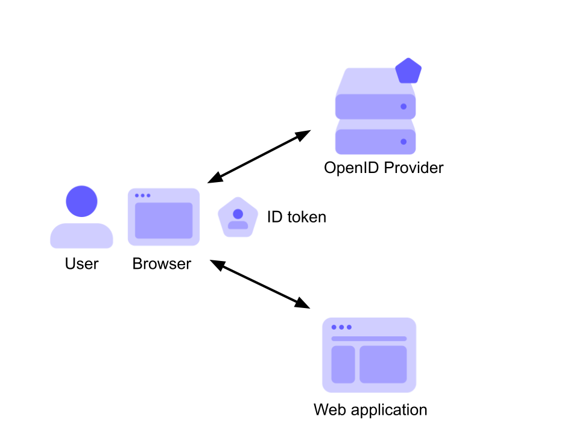
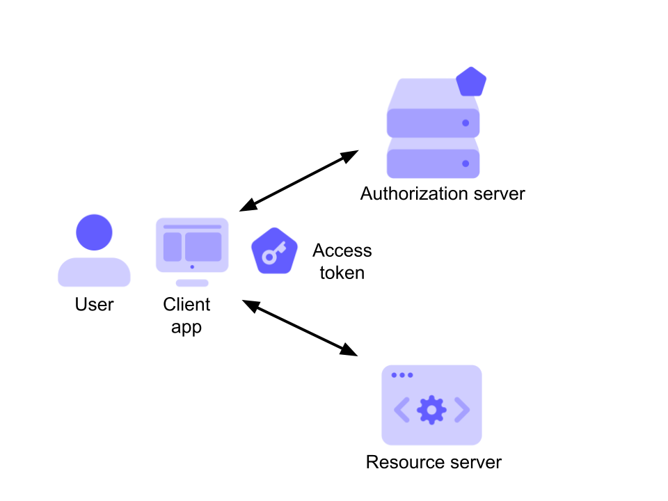

# What is an ID Token

- An ID token is an artifact that proves that the user has been __authenticated__. It was introduced by OpenID Connect, an open standard for authentication used by many identity providers such as Google, Facebook, and, of course, Auth0

- Here, a user with their browser authenticates against an OpenID Connect is the ID token, which is passed to the application as proof that the user has been authenticated.

- An ID token is encoded as a JSON Web Token (JWT), a standard that allows your application to easily inspect its content, and make sure it comes from the expected issuer and that no one else changed it.

- The ID token is signed by the issuer with its private key. This guarantees you the origin of the token and ensures that it has not been tampered with.

- First, it demonstrates that the user has been authenticated by an entity you trust (the OpenID provider) and so you can trust the claims about their identity

- Also, your application can personalize the user's experience by using the claims about the user that are included int the ID token. For example, you can show their name on the UI, or display a "best wishes" message on their birthday.

# What is an Access Token

- In the diagram above, a client application wants to access a resource an API or anything else which is the owner of the resource, and the authorization server. In this scenario, the access token is the artifact that allows the client application to access the user's resource. It is issued by the authorization server after successfully authenticating the user and obtaining their consent.

- Of course, the API receiving the access token must be sure that it actually is a valid token issued by the authorization server that it trusts and make authorization decisions based on the information associated with it. In other words, the API needs to somehow use that token in order to authorize the client application to perform the desired operation on the resource.

- How the access token should be used in order to make authorization decisions depends on many factors: the overall system architecture, the token format, etc. For example, an access token could be a key that allows the API to retrieve the needed information from a database shared with the authorization server, or it can directly contain the needed information in an encoded format. This means that understanding how to retrieve the needed information to make authorization decisions is an agreement between the authorization server and the resource server, i.e., the API.

- OAuth 2 core specifications say nothing about the access token format. It can be a string in any format. A common format used for access tokens is JWT, and a standard structure is available. However, this doesn’t mean that access tokens should be in that format.

