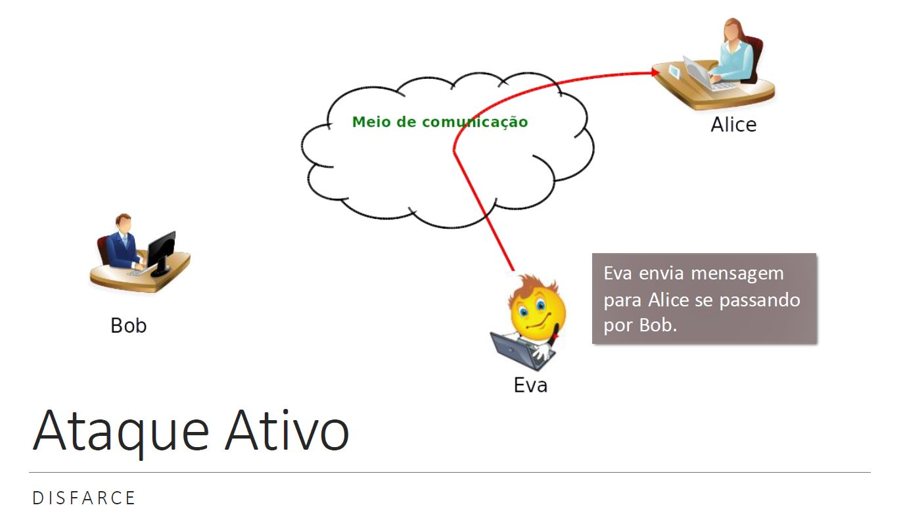

# Época Especial Segurança Informática

---
# Apresentação

## Parte I - Mecanismos e Protocolos Criptográficos

- Esquemas criptográficos
- Métodos para autenticação de chaves públicas
- Protocolos de autenticação e estabelecimentos de chaves

## Parte II - Autenticação e Autorização

- Autenticação baseada em passwords
- Protocolo para gestão distribuída de identidade e autorização
    - Casos de estudo: OpenID Connect, OAuth 2.0
- Modelos, políticas e mecanismos para controlo de acessos
    - Casos de estudo: Listas de controlo de acessos (ACL), Políticas baseada em papeis (RBAC)

## Fundamentos de Segurança Informática

Segurança: proteção de informação
__Prevenir__ e __detetar__ ações não autorizadas

Três principais propriedades: 
- __Confidencialidade__
- __Integridade__
- __Disponibilidade__

### Confidencialidade

Prevenir a divulgação não autorizada da informação.
- Esconder conteúdos de utilizadores não autorizados.
- Informação não pode ser vista nem analisada.
Privacidade:
- Inclui meios de garantir quais informações podem ser divulgadas e para quem.

### Integridade

Garantia de que informações/dados recebidos estão exatamente como foram enviados por uma entidade autorizada.
- Conteúdo não pode ser modificados, corrompido ou perdido por terceiros.
Incluir garantir autenticidade.
- Isto é, garantir que a entidade envolvida é, de facto, aquela que ela afirma ser.
- Autenticidade muitas vezes é definida como um __quarto principio__.
Inclui também impedir que entidades neguem a geração da informação.
- __Não-repúdio__

### Disponibilidade

- Propriedade de ser acessível e utilizável sob demanda por uma entidade autorizada.
-Prevenir __negação de serviço__.
    - _Denial of service (DoS)_.

### Proteção da Informação

Informação e dados estão em:
- Dispositivos de armazenamento;
- __Redes de computadores__

Proteção pode ser a nível de:
- _Hardware_: dispositivos de processamento, armazenamento, ...
- _Software_: sistema operativo, aplicações, bibliotecas, ...
- __Dado__: ficheiros, base de dados, _passwords_, ...
- __Comunicação__: enlaces de comunicação local ou de longa distância, routers, ...

### Exemplos de Ataques

```
Passivos:
- Divulgação de conteúdo
- Análise de tráfego
```
```
Ativos:
- Disfarce
- Repasse
- Modificação de mensagem
- Negação de serviço
```

### Ataque Passivo

#### Divulgação de conteúdo

Bob -----> Alice

Eva atacante

Meio de comunicação: Eva lê o conteúdo da mensagem de Bob para Alice





## Introdução à Criptografia

Termos:
- Criptografia: Ciência de escrever mensagens cifradas.
- Criptoanálise: Ciência de quebrar códigos e decifrar mensagens.
- Criptologia: Ciência que reúne criptografia e criptoanálise.

Composição:
- Função de cifra (E) que gera criptograma c a partir de mensagem m;
- Função de decifra (D) gera m' a partir de c (espera-se m'=m);
- Chave (k);
- Função geradora de chave (G)

- Cifra Simples: Cifra de César

    - Substitui cada letra pela 3ª letra subsequente no alfabeto

    - Carateres da mensagem m são mapeados para números de 0 a 25.
        - Em ordem alfabética

    - Função de geração de chave: G=k=3
        - k é o segredo
    
    - Função de cifra: E(k)(mi)=(mi+k) mod 26=ci
    - Função de decifra: D(k)(ci) = (ci-k) mod 26

    - Criptoanálise da Cifra de César
        - Apenas 25 possíveis cifras
            - Isto é, k varia de 1 a 25.
        - Sem saber k, A pode ser mapeado para: A,B,..., ou Z.
    - Pode-se, simplesmente, tentar um de cada vez.
        - Ataque de _força-bruta_.
        - Dado texto cifrado, tente todas as letras possíveis.
    - É preciso reconhecer o texto plano.
    - Texto em claro é a mensagem antes de ser cifrada.

- Cifra de Vigenère
    - É uma cifra de substituição polialfabética.
    - Chave é subconjunto do alfabeto
        - Exemplo:FRUTA
    -Alinha-se a chave com a mensagem.
        - Repete-se a chave até atingir o comprimento da mensagem
    - Alfabeto é modelado com 26 letras
        - Em ordem alfabética
    - Função de geração de chave: G=k.
        - Conjunto de caracteres do alfabeto de tamanho x<n
        - n é o número de caracteres na mensagem m.
    - Função de cifra: E(k)(mi)=(mi+kimodx)mod 26 = ci
    - Função de decifra: D(k)(ci) = (ci-kimodx)mod 26

---
# Esquemas Simétricos
    Esquemas de confidencialidade e autenticidade
    Primitivas de cifra simétrica e modos de operação

### Proteção criptográfica de dados


| Situação | Ameaça | Ação |
| -------- | ------ | ---- |
| Dados em repouso: No dispositivo do utilizador, na rede interna, na cloud | Processo malicioso ou não autorizado pode ler ou modificar dados | Cifra e autenticação de ficheiros/discos e comunicações |
| Dados estão a ser transferidos entre computadores (ex: browser<->servidor) | Um atacante com acesso è rede pode ler ou modificar os dados |

### Mecanismos criptográficos

- Primitivas - Operações matemáticas, usadas como blocos construtores na realização de esquemas; a sua caracterização depende dos problemas matemáticos que sustentam a sua utilização criptográfica.
    - ex: DES, RSA
- Esquemas - combinação de primitivas e métodos adicionais para a realização de tarefas criptográficas como a cifra e a assinatura digital
    - ex: DES-CBC-PKCS5Padding; RSA-OAEP-MGF1-SHA1
- Protocolos - sequências de operações, a realizar por duas ou mais entidades, envolvendo esquemas e primitivas, com o propósito de dotar uma aplicação com características seguras.
    - ex: TLS com TLS_RSA_WITH_DES_CBC_SHA
### Introdução à criptografia computacional

- Esquemas simétricos
    - Cifra e autenticidade
- Esquemas assimétricos
    - Cifra e assinatura digital

|   | Simétrico | Assimétrico |
| - | --------- | ----------- |
| __Confidencialidade__ | Cifra simétrica | Cifra assimétrica |
| __Autenticidade__ | MAC | Assinatura Digital |

### Características gerais da criptografia simétrica

- Processo de _proteção_ e _desproteção_ usando a mesma chave
- Chaves são normalmente usadas durante pouco tempo
- Chaves estabelecidas após um processo de negociação entre quem cifra e quem decifra.

## Cifra simétrica

M -> |Cifrar + (Chave simétrica)| -<Canal inseguro ex: rede de comunicações, pen USB>-> |Decifrar + (Chave simétrica)| -> M'

### Esquema de cifra simétrica

- Esquema de cifra simétrica - algoritmo (G,E,D)
    - G - função (probabilística) de geração de chaves
        - G: -> Keys
    - E - função (probabilística) de cifra
        E: Keys -> {0,1}* -> {0,1}*
    - D - função (determinística) de decifra
        D: Keys -> {0,1}* -> {0,1}*

m-> | E + k | -<c=E(k)(m)>-> | D + k | -> m'
G->k

### Propriedades da cifra simétrica

- Propriedades da correção
    - __QUALQUER__ m __PERTENCENTE__ {0,1}*, __QUALQUER__ k __PERTENCENTE__ __Keys__: D(k)(E(k)(m))=m
        - __Keys__ é o conjunto de chaves geradas por G
    - Propriedades de segurança
        - É computacionalmente infazível obter __m__ a partir de __c__, sem o conhecimento de __k__.
    - Esquema simétrico
        - utilização da mesma chave __k__ nas funções E e D.
    - Mensagem __m__ e _criptograma_ __c__ são sequencias de _bytes_ com dimensão variável ({0,1}*)
    - Não garante integridade
    -Exemplos: 
        - DES-CBC-PKCS5Padding

## Autenticação de mensagens

M -> | Autenticar + Chave simétrica | - |M + marca| <Canal inseguro ex: rede de comunicações, pen USB>-> | Verificar + Chave simétrica | -> válido ou inválido

## Esquema MAC

- Esquema MAC (_Message Authentication Codes_) - algoritmos (G,T,V)
    - G - função (probabilística) de geração de chaves
        - G: -> __Keys__
    - T - função (probabilística) de geração de marcas
        - T: Keys -> {0,1}* -> Tags
    - V - função (determinística) de verificação de marcas
        V: Keys -> (Tags x {0,1}*) -> {true, false}

m -> |T + k| -<m, t = T(k)(m)>-> |V + k| -> V __PERTENCENTE__{true, false}

G->k

- Esquema usual para o algoritmo de verificação
    - Algoritmo T é determinístico
    - Algoritmo V usa T
    - V(k)(t, m): T(k)(m)=t

### Propriedades do MAC

- Propriedade da correção
    - __QUALQUER__ m __PERTENCENTE__ {0,1}*, __QUALQUER__ k __PERTENCENTE__ Keys: V(k)(T(k)(m),m)=true
- Propriedades de segurança
    - Sem o conhecimento de k, é computacionalmente infazível
        - falsificação seletiva - dado m, encontrar t tal que V(k)(t,m) = true
        - falsificação existencial - encontrar o par (m, t) tal que V(k)(t,m) = true
- Esquema simétrico
    - Utilização da mesma chave k nos algoritmos T e V
- Mensagem m é uma sequencia de bytes de dimensão variável
- Marca t (tag) tem tipicamente dimensão fixa
    - Por exemplo: 160, 256, 512 bits
- Códigos detetores e corretores de erros não servem para esquemas de MAC
- Exemplos: HMAC-SHA1

## Primitivas de cifra simétrica

- Para usar um esquema de cifra simétrica é preciso escolher uma primitiva de cifra
    - AES,DES, Blowfish, ...
- Algumas primitivas estão especificadas em _standards_ internacionais ou em publicações académicas.
- Boas práticas
    - Usar algoritmos seguros públicos
    - Usar implementações de confiança

- Primitiva de cifra em bloco
    - Função E:{0,1}| -> {0,1}^n -> {0,1}^n
    tal que QUALQUER k PERTENCENTE {0,1}| a função E(k) é uma permutação
    - Designa-se por D:{0,1}| -> {0,1}^n->{0,1}^n a função que verifica
    QUALQUER k PERTENCENTE {0,1}| e QUALQUER m PERTENCENTE {0,1}^n:D(k)(E(k)(m))=m
- A dimensão do bloco é __n__ (ex. 64 bit, 128 bit)
- A dimensão das chaves é __I__ (ex. 56 bit, 128 bit, 256 bit)

Bloco (n bits)                          Bloco (n bits)
| E |           <--Chave(I bits)-->     | D |

### Características gerais das primitivas simétricas

- A dimensão __n__ do bloco deve ser suficientemente elevada para impossibilitar ataques baseados na estatística do texto em claro

- A dimensão da chave __I__ deve ser suficientemente elevada para impossibilitar ataques de pesquisa exaustiva
- Elementos construtores
    - Substituições
    - Transposições

## Modos de operação

Problema: Como efetuar a cifra de mensagens com dimensão superior à de um bloco?

- Considerações 
    - Padrões no texto em claro não deverão ser evidentes no texto cifrado
    - A eficiência do método usado não deverá ser muito inferior à eficiência da primitiva de cifra em bloco usada
    - A dimensão do texto cifrado deve ser aproximadamente igual à dimensão do texto em claro
    - Em algumas aplicações é importante qua a decifra seja capaz de recuperar de erros, adições e remoções de bits no texto cifrado
    - Acesso aleatório - capacidade de decifrar e alterar apenas parto do criptograma

## Modo Electronic-Codebook (ECB)

- A primitiva garante que os padrões do bloco em claro não passam para os bloco cifrado

- E se o bloco se repetir na mensagem?

mL
E(k)
cL
D(k)
mL

- Blocos de texto em claro iguais:
    - Blocos de texto em claro iguais, cifrados com a mesma chave, implicam blocos de texto cifrado iguais
- Interdependência na cifra:
    - A cifra é realizada de forma independente de bloco para bloco
- Propagação de erros:
    - A ocorrência de erros num bloco de texto cifrado afeta apenas a decifra desse bloco.
- Acesso aleatório para decifra e "recifra" de múltiplos de blocos

## Modo cipher block chaining (CBC)

- Blocos de texto em claro iguais:
    - Sob a mesma chave e sob o mesmo vetor de iniciação, duas mensagens iguais implicam criptograma iguais
- Interdependência na cifra:
    - A cifra de um bloco de texto em claro afeta a cifra dos blocos seguintes
- Propagação e recuperação de erros:
    - A ocorrência de erros num bloco cj de texto cifrado afeta a decifra do próprio bloco e a do bloco seguinte cj+1. A decifra do bloco cj+1 terá erros nas mesmas posições que cj.
- Observações: 
    - A reordenação dos blocos de texto cifrado afeta a decifra
    - É relativamente fácil manipular um determinado bloco de texto em claro
### Boas práticas sobre o IV

- Deve ser armazenado/transmitido em claro
- Não se deve repetir (uniqueness)
- Não de ve ser previsível

## _Padding_

- Seja X o número de bytes a acrescentar para que a dimensão da mensagem seja múltipla da dimensão do bloco
- Ex: PKCS# 5 (CBC-PAD):
    - Acrescentar X bytes com o valor X
    - Utilizações PKCS# 7, CMS, SSL
- A segurança do esquema depende da forma de padding?
    - Ataque proposto por S. Vaudenay: chosen ciphertext attack utilizando o destinatário como oráculo que recebe criptograma e retorna 1 ou 0 conforme o _padding_ esteja correto ou não

## Demonstração com OpenSSL
- Cifra e MAC

### Cipher
openssl enc -des-cbc -e -in mensagem.txt -out mensagem.cif -iv 7766554433221100 -K 0011223344556677

### Decipher
openssl enc -des-cbc -d -in mensagem.cif -out mensagem_original.txt -iv 7766554433221100 -K 0011223344556677

### Decipher and show padding
openssl enc -des-cbc -d -nopad -in mensagem.cif -out mensagem_original.txt -iv 7766554433221100 -K 0011223344556677

### hmac com sha256 using key "myscretkey"
openssl dgst -hmac mysecretkey mensagem.txt

### sha256
openssl dgst -sha256 messagem.txt

## Modos de operação em _stream_

- Modos como CBC precisam de algoritmos diferentes para cifra e decifra

- Modo de operação em _stream_

mi(n bits) XOR IV(GERADOR DE KEYSTREAM)(n bits) = cifra -cj-> XOR IV(GERADOR DE KEYSTREAM)(n bits) = decifra mi

- Modo _Stream_
    - Estado __I__
    - Key stream __ks__
    - Ksi = E(k)(Ii)
    - ci = mi XOR ksi
- Cipher FeedBack (CFB)
    - Ii = ci-1
- Output FeedBack (OFB)
    - Ii = ksi-1
- Counter (CTR)
    - Ii = f(Ii-1)
- Problema:
    - se ksi = ksj então mi XOR mj = ci XOR cj

## Modo Counter (CTR)

- Blocos de texto em claro iguais:
    - Sob a mesma chave e sob o mesmo vetor de iniciação, duas mensagens iguais implicam criptograma iguais.
- Propagação e recuperação de erros:
    - A ocorrência de erros num bloco de texto cifrado cj afeta apenas a decifra desse bloco. O bloco mj resultante da decifra do bloco cj terá erros nas mesmas posições que cj.
- Acesso aleatório:
    - Permite acesso aleatório para decifra e "recifra" de bits
- Observações:
    - É relativamente fácil manipular um determinado bloco de texto em claro.

## Cifra autenticada

    Para garantir confidencialidade e simultaneamente autenticidade, tem de se usar uma combinação dos esquemas Cifra e MAC

- Existem duas abordagens
    - _Encrypt-then-MAC_
        - E(k1)( M || T(k2)(M) )
        - A marca indica se houve alteração ou não do criptograma
    - _MAC-then-encrypt_
        - E(k1)(M || T(k2)(M) )
        - A marca é gerada sobre a mensagem, e é posteriormente tudo cifrado
- Existem modos de operação cujo objetivo é produzirem uma cifra autenticada, combinando as operações num só algoritmo
    - Galois Counter Mode (GCM)
    - Offset codeBook mode (OCB)
    - Counter with CBC-MAC (CCM)

---
# Funções de hash

- Função de _hash_ criptográfica
    - H: {0,1}* -> {0,1}^n, onde n é a dimensão do _hash_
    - Entrada:
        - Sequência binária de dimensão finita
    - Saída:
        - Sequência binária de dimensão fixa (__n__)
    - __n__ é a dimensão do _hash_

m -> | H | -> h=H(m)

mensagem -> _hash_ da mensagem

## Notas

- Propriedades de segurança 
    - É computacionalmente fácil obter H(x) dado x
    - É computacionalmente difícil, dado x, obter x' __DIFERENTE__ tal que H(x') = H(x)
        - Segunda pré-imagem
    - É computacionalmente difícil obter (x, x'), com x' __DIFERENTE__ x, tal que H(x) = H(x')
        - __colisão__
- O hash de m serve como representante ("impressão digital") de m
- Exemplos de dimensões: MD5 (n=128) e SHA-1 (n=160)
- Baseiam-se em operações booleanas e aritméticas sobre palavras de pequena dimensão (16, 32, 64 bit)

## Segunda pré-imagem e colisões

- Segunda pré-imagem - Dado x2 e h2, encontrar x4 deve ser computacionalmente difícil.
- Colisão - Encontrar (x3,x5) ou (x2,x4) deve ser computacionalmente difícil

| pré-imagens | imagens |
| ----------- | ------- |
| x1 | h1 |
| x2,x4 | h2 |
| x3,x5 | h3 |

- Considere um conjunto de pré-imagens {x1,x2,x3,x4,x5} e imagens {h1,h2,h3}
- Exemplo: a função SHA256 tem 2^256 imagens possíveis

## Exemplos de aplicação

- Garantia de integridade de dados
- Derivação de chaves a partir de _passwords_
- Algoritmos de MAC
- Assinatura digital (esquema assimétrico)
- Diversos protocolos criptográficos

## Exemplo de utilização : integridade

- Exemplo: Distribuição de _software_
    1. Produtor calcula o _hash_ da distribuição (ex. sources.tar.gz)
    2. Cliente obtêm, de forma autenticada, o _hash_ da distribuição
    3. Cliente obtêm  distribuição (ex. através dum _mirror_ não autenticado)
    4. Cliente compara o _hash_ da distribuição recebida com o _hash_ obtido em 2

## Exemplo de comandos openssl e outros

```
openssl dgst -sha256 file.c
```

```
openssl sha256 file.c
```

```
md5sum file.c
```

```
sha256sum file.c
```

## Funções de hash com chave

- É usual designar-se um esquema de MAC, com algoritmo __T__ determinístico, como função de hash com chave (Keyed Hash Function)
- HMAC é um conjunto de algoritmos MAC para usar com diferente funções de hash H
- Exemplo da estrutura HMAC

# Esquemas assimétricos
- Cifra
- Assinatura digital

- Esquemas simétricos
    - A mesma chave é utilizada na cifra e na decifra
    - A mesma chave é utilizada na geração da marca e na verificação da marca
- Esquemas assimétricos
    - Esquemas de cifra - qual a operação privada?
        - "Todos podem cifrar, apenas o recetor autorizado pode decifrar"
    -Esquemas de autenticação - qual a operação privada?
        - "Todos podem verificar, apenas o emissor autorizado pode assinar (gerar a marca)"
- Utilização
    - Transporte seguro de chaves simétricas
    - Assinatura digital

## Cifra assimétrica - visão geral

M -> |Cifrar(Chave pública)| -<Canal inseguro>-> |Decifrar(Chave privada)| -> M'

- Esquemas de cifra assimétrica - algoritmos (G,E,D)

    - G - função (probabilística) de geração de pares de chaves
        - G: -> __KeyPairs__, onde __KeyPairs__ __CONTIDO__ __PublicKeys__ x __PrivateKeys__
        - E - função (probabilística) de cifra
            - E: __PublicKeys__ -> __PlainTexts__ -> __CipherTexts__
        - D - função (determinística) de decifra
            - D: __PrivateKeys__ -> __CipherTexts__ -> __PlainTexts__

m -> |E(ke=Chave pública)| -<c=E(ke)(m)>-> |D(kd=Chave privada)| -> m'=D(kd)(c)

G(Geração de chaves) -> chave pública x chave privada

### Notas

- Propriedade da correção
    - __QUALQUER__ m __PERTENCENTE__ M, __QUALQUER__ (ke,kd) __PERTENCENTE__ ___KeyPairs___: D(kd)(E(ke)(m))=m
- Propriedades de segurança
    - É computacionalmente infazível obter m a partir de c, sem o conhecimento de __kd__
- Esquema assimétrico
    - Utilização de chaves diferentes para os algoritmos __E__ e __D__
- O espaço de mensagens, denotado por __PlainTexts__, é definido por todas as sequências de bits com dimensão menor do que o limite definido pelo esquema.
- O espaço de criptograma, denotado por __CipherTexts__, é definido como um sub-conjunto das sequências de bits com dimensão menor do que o limite definido pelo esquema.
- Não garante integridade

- Custo computacional significativamente maior do que os esquemas simétricos (maior do que duas ordens de grandeza)
- Limitações na dimensão da informação cifrada
    - Note-se que a entrada de __E__ é __PlainTexts__ e não __{0,1}*__
- Utilização em esquemas híbridos
    - _Esquema assimétrico_ usado para cifrar uma chave simétrica - __transporte de chaves__
    - Esquema simétrico usado para cifrar a informação

## Princípios da primitiva RSA

- Sejam P e Q dois primos distintos e N = PQ
    - Dimensões típicas: 2^1023 <= N <= 2^4095
- Sejam E e D tal que ED mod (P-1)(Q-q)=1
- Par de chaves
    - Chave pública: (E, N)
    - Chave privada: (D, N)
- Operação pública (utilizada na cifra)
    - C = M^E mod N
- Operação privada (utilizada na decifra)
    - M = C^D mod N
- A fatorização de números primos é o problema que suporta a primitiva __RSA__

## Esquema híbrido

- Devido ao seu elevado custo computacional, a cifra assimétrica é na prática usada para proteger chaves simétricas

m -> |E + k| -<cm=E(k)(m)>->                   |D + k| -> m'=D(k)(cm)
          |                                         |
|Gs|    -<k>-> |Ea + ke| -<ck=E(ke)(k)>-> |Da + kd| -> k'=D(kd)(ck)

Ga -> ke = chave pública
Ga -> kd = chave privada

### Cifra assimétrica: arquitetura interna

PKCS#1 v1.5, OAEP

m -> |Formatação (método adicional)| --> |Cifra (primitiva)| _______
                                      |         |                   |
                                      E         ke                  c
                                          D          kd             |
                                          |          |              |
m <- |Desformatação (método adicional)| <-- |Decifra (primitiva)| <--

### Resumo da cifra assimétrica

- A arquitetura típica dos algoritmos de cifra e decifra dos esquemas de cifra assimétrica é constituída por:
    - Primitiva de cifra assimétrica - ex. RSA
    - Método de formatação ou _padding_ - ex. PKCS #1 v1.5, OAEP
- A mesma primitiva pode ser usada com vários tipos de formatação
- A função da formatação é:
    - Adequar a entrada do algoritmo (__PlainTexts__) à entrada da primitiva
    - Evitar casos especiais
    - Introduzir informação aleatória
- As chaves são usadas apenas pela primitiva
    - Exemplo: chaves da primitiva RSA podem ser usada nos esquemas RSA+PKCS#1 v1.5 ou RSA+OAEP

## Assinatura digital - Visão geral

- Cada interveniente tem 1 par de chaves por cada identidade digital
- Processo de assinatura usa chave privada
    - Ex: Só "Bob" pode assinar
- Processo de verificação usa chave pública
    - Ex: todos podem verificar
- Par de chaves usadas durante um largo período de tempo
- Chave pública difundida através de _certificados digitais_

M -> |Assinar + Chave privada| -<M + assinatura (Canal inseguro)>-> |Verificar + Chave pública| -> Válida ou Inválida

### Esquema de assinatura digital

- Esquema de assinatura digital - algoritmos (G,S,V)
    - G - função (probabilística) de geração de pares de chaves
        - G: -> __KeyPairs__, onde __KeyPairs__ __Contido__ __PublicKeys__ x __PrivateKeys__
    - S - função (probabilística) de assinatura
        - S: __PrivateKeys__ -> {0,1}* -> __Signatures__
    - V - função (determinística) de verificação
        - V: __PublicKeys__ -> (__Signatures__ x {0,1}*) -> {true,false}

-> |S+ks| -<m, s = S(ks)(m)>-> |V+kv| -> v=V(kv)(s,m)

G -> ks = chave privada
G -> kv = chave pública

### Notas

- Propriedades da correção
    - __QUALQUER__ m __PERTENCENTE__ {0,1}*, __QUALQUER__ __PERTENCENTE__ (ks,kv) __PERTENCENTE__ KeyPairs: V(kv)(S(ks)(m),m)=true
- Propriedade de segurança
    - S em o conhecimento de __ks__ é _computacionalmente infazível_
        - falsificação seletiva - dado __m__, encontrar __s__ tal que __V(kv)(s,m) = true__
        - falsificação existencial - encontrar o par (m,s) tal que __V(kv)(s,m) = true__
    - note-se que __kv__ é conhecido
- Assinaturas __s__ (__PERTENCENTE__ ao conjunto __Signatures__) tem tipicamente dimensão fixa
    - Ex.: 160, 1024, 2048 bits
- Custo computacionalmente significativamente maior do que os esquemas simétricos
- Assimétrico
    - utilização de chaves diferentes para os algoritmos __S__ e __V__
- Mensagem __m__ é uma sequência de _bytes_ de dimensão variável
- assinar __DIFERENTE__ decifrar; verificar __DIFERENTE__ cifrar

m -> |Função de _hash_(MD5, SHA1)| -> |Format (método adicional)(PKCS#1 v1.5, PSS, X9.31)| -> |Sign (primitiva)(RSA, DSA) + ks(Chave privada)|
Bloco S -> Signature

m -> |Função de hash| -> |Deformat (método adicional) -> v({true,false})| <- |Verify (primitiva) + kv(Chave pública)|
Bloco V -> Verify

### Assinatura digital: arquitetura interna

- A arquitetura típica dos algoritmos de assinatura e verificação dos esquemas de assinatura digital é constituída por:
    - Primitiva de assinatura/verificação assimétrica - ex. RSA
    - Método de formatação ou _padding_ - ex. PKCS#1 v1.5, PSS
    - Função de _hash_
- A mesma primitiva pode ser usada com vário tipos de formatação e funções de _hash_
- As chaves são usadas apenas pela primitiva
    - Exemplo: chaves da primitiva RSA podem ser usada nos esquemas RSA+PKCS#1 v1.5 ou RSA+PSS

---
# Java Cryptography Architecture (JCA)

## Princípios de desenho

- Independência dos algoritmos e expansibilidade
    - Utilização de esquemas criptográficos, como assinatura digital e a cifra simétrica, independentemente dos algoritmos que os implementam
    - Capacidade de acrescentar novos algoritmos para os mecanismos criptográficos considerados
- Independência da implementação e interoperabilidade
    - Várias implementações para o mesmo algoritmo
    - Interoperabilidade entre várias implementações, por exemplo, assinar com uma implementação e verificar com outra
    - Acesso normalizado a características próprias dos algoritmos

## Esquemas, algoritmos e implementações

            Esquemas
    Algoritmos A    Algoritmos B

Implementações A1 Implementações A2

## Arquitetura

- Arquitetura baseada em:
    - _CSP_ - _Cryptographic Service Provider_
        - _package_ ou conjunto de _packages_ que implementam um ou mais mecanismos criptográficos (serviços criptográficos)
    - _Engine Classes_
        - Definição abstrata (sem implementação) dum mecanismo criptográfico
        - A criação dos objetos é realizada através de métodos estáticos __getInstance__
    - _Specification Classes_
        - Representações normalizadas e transparentes de objetos criptográficos, tais como chaves e parâmetros de algoritmos.

## _Providers_

- Fornecem a implementação para as _engines classes_
    - Implementam as classes abstratas <EngineClass>Spi, onde _EngineClass_ é o nome duma _engine class_
- Classe __Provider__ é base para todos os _providers_
- Instalação
    - Colocar _package_ na _classpath_ ou na diretoria de extensões
    - Registar no ficheiro _java.security_
    -Em alternativa, usar a classe __Security__
- Classe __Security__
    - Registo dinâmico de _providers_
    - Listagem de _providers_ e algoritmos

Aplicação
Cipher
JCA
CipherSpi   CipherSpi
Provider    Provider

## Engines classes

- Classes: __Cipher__ (esquemas simétricos e assimétricos), __Mac__, __Signature__, __MessageDigest__, __KeyGenerator__, __KeyPairGenerator__, __SecureRandom__, ...
- Métodos _factory_
    - static Cipher getInstance(String transformation)
    - static Cipher getInstance(String transformation, String provider)
    - static Cipher getInstance(String transformation, Provider provider)
- Os algoritmos concretos e as implementações concretas (_providers_) são identificados por _strings_
- _Delayed Provider Selection_
    - A seleção do _provider_ adequado é adiada até à iniciação com a chave
    - Permite a seleção do _provider_ com base no tipo concreto da chave

### Exemplo com cifra simétrica

Cipher
"algorithm/model/padding" ou "algorithm"

algorithm: AES, DES, DESede, RSA, ...
mode: ECB, CBC, CTR, OFB, ...
padding: PKCS5Padding, ...

m-> |E+k| -<c=E(k)(m)>-> |D+k| -> m'

G->k

<<Engine class>>|Cipher| -> <<Engine class>>|SecureRandom| <- <<Engine class>> |KeyGenerator| -> <<Interface>>|SecretKey|

## Transformações normalizadas

- Ver apêndice A de "Java Cryptography Architecture (JCA) Reference Guide"
- __Cipher__
    - "algorithm/mode/padding" ou "algorithm"
    - algorithm: AES, DES, DESede, RSA, ...
    - mode: ECB, CBC, CFB, CTR, OFB, ...
    - padding: PKCS5Padding, PKCS1Padding, OAEPPadding
- __MAC__
    - hmac[MD5 | SHA1 | SHA256 | SHA384 | SHA512], ...
- __Signature__
    - [MD5 | SHA1 | ...]withRSA, SHA1withDSA,...
- __KeyGenerator__
    - AES, DES, DESede, Hmac[MD5 | SHA1 |...], ...
- __KeyPairGenerator__
    - RSA, DSA, ...

## Classe Cipher
- Método __init__ (várias sobrecargas)
    - Parâmetros: modo (cifra, decifra, _wrap_ ou _unwrap_), chave, parâmetros específicos do algoritmo e gerador aleatório
- Métodos de cifra
    - __update: byte[] -> byte[]__ - continua a operação incremental
    - __doFinal: byte[] -> byte[]__ - finaliza a operação 
    - _wrap: Key -> byte[]_ - cifra chave
    - _unwrap: byte[], ... -> Key_ - decifra chave
- Métodos auxiliares
    - byte[] getIV()
    - AlgorithmParameters getParameters()

## Cipher: operação incremental

- Nota: E(k)(m1||m2) __DIFERENTE__ E(k)(m1)|| E(k)(m2)
- Cifra de mensagens com grande dimensão ou disponibilizadas parcialmente
    - Método _update_ recebe o final da mensagem e retorna parte do criptograma
    - Método _doFinal_ recebe o final da mensagem e retorna o final do criptograma

|   |   |   |   |
  |   |   |   |
  u   u   u   doF
|   |   |   |   |
u=update
doF=doFinal

## Streams

- Classe __CipherInputStream: FilterInputStream__
    - Processa (cifra ou decifra) os _bytes_ lidos através do _stream_
    - __ctor(InputStream, Cipher)__
- Classe __CipherOutputStream: FilterOutputStream__
    - Processa (cifra ou decifra) os bytes escritos para o stream
- Classe __DigestInputStream : FilterInputStream__
    - Processa (calcula o _hash_) os bytes lidos através do stream
    - ctor(InputStream, MessageDigest)
    - MessageDigest getMessageDigest()
- Classe __DigestOutputStream: FilterOutputStream__
    - Processa (calcula o _hash_) os bytes escritos para o stream

## Parâmetros

- Parâmetros adicionais dos algoritmos
    - Exemplos: vetor inicial (IV), dimensões das chaves
- Representação opaca: engine class __AlgorithmParameters__
- Representação transparentes: classes que implementam a interface __AlgorithmParameterSpec__
    - Exemplos: __IvParameterSpec__, __RsaKeyGenParameterSpec__, ...
- Geração: engine class AlgorithmParameterGenerator,...
- Transformação entre representações transparentes e representações opacas: métodos de __AlgorithmParameters__

## Chaves

- Interface Key
    - String getAlgorithm()
    - byte[] getEncoded()
    - String getFormat()
- Interfaces __SecretKey__, __PublicKey__ e __PrivateKey__
    - Derivam de __Key__
    - Não acrescentam métodos (marker interfaces)
- Classe concreta __KeyPair__
    - Contém uma __PublicKey__ e uma __PrivateKey__
- Geração através das engine classes __KeyGenerator__ e __KeyPairGenerator__

## Representações: opacas e transparentes

- Chaves opacas: representações de chaves sem acesso aos seus constituintes
    - Derivadas da interface __Key__
    - Especificas de cada provider
    - Geradas pelas engine classes KeyGenerator e __KeyGenerator__ e __KeyPairGenerator__
- Chaves transparentes: representações de chaves com acesso aos seus constituintes
    - Derivadas da interface __KeySpec__
    - Os packages __java.security.spec__ e __javax.crypto.spec__ definem um conjunto de classes <nome>Spec com interface normalizada para o acesso aos constituintes das chaves de diversos algoritmos.
    - Exemplos: __RsaPublicKeySpec__, __DESKeySpec__, __SecretKeySpec__, ...
- __KeyFactory__ - engine class para conversão entre representações opacas e transparentes

## Chaves, geradores e fábricas

    <<Engine class>>
    KeyFactory
    PrivateKey generatePrivate(KeySpec)
    PublicKey generatePublic(KeySpec)
    KeySpec getKeySpec(Key, Class)
    <<Interface>> PublicKey
    <<Interface>> PrivateKey

    <<Engine class>>
    SecretKeyFactory
    SecretKey generateSecret(KeySpec)
    KeySpec getKeySpec(Key, Class)
    <<Interface>> SecretKey

    <<Engine class>>
    KeyPairGenerator
    void initialize (int, SecureRandom)
    void initialize (AlgorithmParameterSpec, SecureRandom)
    KeyPair generateKeyPair()
    KeyPair <<Interface>>PublicKey <<Interface>>PrivateKey

<<Engine class>>
KeyGenerator
void init(int, SecureRandom)
void init (AlgorithmParameterSpec, SecureRandom)
SecretKey generateKey()

## Classe Mac

- Método __init__ (várias sobrecargas)
    - Parâmetros: chave e parâmetros específicos do algoritmo
- Métodos de geração de marca
    - update: byte[] -> void - continua a operação incremental
    - doFinal: byte[] -> byte[] - finaliza  a operação incremental, retornando a marca
- Métodos auxiliares
    - int getMacLength()
    - ...

### Mac: operação incremental

- MAC de mensagens com grande dimensão ou disponibilizadas parcialmente
    - Método __update__ recebe parte da mensagem
    - Método __doFinal__ recebe o final da mensagem e retorna a marca

|   |   |   |   |
  |   |   |   |
  u   u   u   doF
              |
              t
## Classe Signature

- Método __initSign__ (várias sobrecargas)
    - Parâmetros: chave privada e gerador aleatório
- Método __initVerify__ (várias sobrecargas)
    - Parâmetros: chave pública

- Métodos de geração de assinatura
    - __update:byte[] -> void__ - continua a operação incremental
    - __sign:void -> byte[]__ - finaliza operação incremental, retornando a assinatura
- Métodos de verificação de assinatura
    - __update: byte[] -> void__ - continua a operação incremental
    - __verify: byte[] -> {true,false}__ - finaliza a operação incremental, retornando a validade da assinatura

### Signature: operação incremental

- Assinatura/verificação de mensagens com grande dimensão ou disponibilizadas parcialmente
    - __update__ recebe as partes da mensagem
    - __sign/verify__ produz/verifica a assinatura

|   |   |   |
  |   |   |
  u   u   u            sign
                        |
|   |       |   |       s
  |     |     |         |
  u     u     u       verify
                        |
                        v

# Infraestruturas de chave pública
- Certificados
- Caminhos de certificação
- Perfil PKIX
- Certificados e PKIX na JCA

## Autenticação de chaves públicas

- Autenticação de chaves públicas
    - "A chave Key pertence a Name?"
Exemplo de problema conhecido como _man-in-the-middle_

        -ALice's public key-> |Mallory|     -Mallory's public key->
Alice       <-secret data-    |Mallory|         <-secret data-      Bob


- Se Bob usar as chaves públicas de Mallory
 como sendo de Alice
    - Mallory pode decifrar as mensagens enviadas para Alice, ou
    - Mallory pode modificar mensagens de Alice e assinar com a chave privada de Mallory
- As chaves públicas tem de ter garantia de autenticidade
    - Certificados: associação autenticada entre identidade e chave pública

## Certificados: Introdução

- Constituição dum certificado
    - Quem certifica - emissor
    - O que certifica
    - Outros atributos - validade, condições de aplicabilidade
    - Assinatura do emissor

- Certificados X.509
    - Quem certifica (emissor): Autoridade de Certificação (AC)
    - O que certifica: associação entre uma chave pública e um nome(identidade)
    - Outros atributos - validade, usos da chaves, extensões
    - Assinatura do emissor - assinatura digital realizada com a chave de assinatura (privada) do emissor

## Verificação da cadeia de certificação

- Para verificar a assinatura de um certificado é preciso a chave pública do seu emissor

Raiz de confiança
- Certificado auto-assinado
- Instalado explicitamente no sistema

Emissor B<- Emissor C<- Emissor D<- Emissor D
Sujeito A  -Sujeito B  -Sujeito C  -Sujeito D
Assinatura<-Assinatura<-Assinatura<-Assinatura

Sujeito D
Raiz de confiança
- Certificado auto-assinado
- Instalado explicitamente no sistema

## Caminho de certificação

- Recursão
    - Obter chave pública -> validar certificado -> obter chave pública (do issuer)
- Condição de paragem
    - Trust anchor - Certificado auto-assinado (issuer=subject)

Certificado auto-assinado (subject=issuer) Certificado raiz
Trust Anchor Confiança e garantia de autenticidade explícita

Certificado intermédios         |
                                |
Certificado folha               | -> caminho de certificação cadeia de certificação
Certificado end-entity          |

## Modelo de domínios separados

Autoridades de certificação CA1, CA2, CA3
End-Entity                  |||||||||||||

- Para existir interoperabilidade, todos os utilizadores devem confiar em todas as autoridade de certificação
- Modelo usado na Internet - Não existe CA central

## Certificados e chaves privadas

- Os certificados guardam apenas a chave pública
- A chave privada fica "associada" ao certificado em armazenamento próprio
- Exemplos
    - Cartão de cidadão 
        - certificado pode ser exportado mas a chave privada não saí da memória do cartão
        - operações "privadas", decifra e assinaturas, são feitas pelo hardware do cartão
    - Formatos para guardar chaves privadas
        - PEM format
        - PKCS#12/PFX
    - Certificados de servidores aplicacionais
        - browser recebe apenas a chave pública
    - Certificados da série de exercícios

## Demos
- Visualização de certificados (folhas e raízes)
## Sintaxe - ASN.1
- Abstract Syntax Notation 1
    - Sintaxe e regras para a especificação de objetos abstratos
- Regras de codificação
    - Forma de representar os objetos abstratos como sequência de bits
    - DER - Distinguished Encoding Rules
    - BER - Basic Encoding Rules
- Object Identifier (OID)
    - Identificador único constituído por uma sequência de inteiros que representa uma hierarquia
    - Ex.: RSA "1.2.840.113549.1.1.1"
- Exemplo
    - chave pública RSA (norma PKCS #1)

## Certificados X.509: constituição

- Certificado 
- Informação assinada
- Validade
- Chave pública
- Extensões

### Extensões

- A versão 3 da norma X.509 acrescenta extensões à informação assinada(tbsCertificate)
- As extensões são a forma normalizada de acrescentar informação não considerada na forma base
- Constituição duma extensão
    - Identificador da extensão
    - Valor da extensão
    - flag critical (se true, a extensão não pode ser ignorada)
- Perfil
    - Conjunto de extensões e respetiva semântica, usados num domínio de aplicação
    - ex.:
        - PKIX - Public Key Infrastructure for the Internet

## Perfil PKIX

- Algumas extensões
    - Authority Key Identifier - identificador da chave do emissor
    - Subject Key Identifier - identificador da chave do subject
    - Key Usage - usos permitidos para o par de chaves
    - Alternative Name - nome alternativo (email, IP, URI)
    - Policy Constraints - identificador de política
    - Basic Constraints - restrições ao uso do certificado
    - Name Constraints - restrições ao espaço de nomes do certificado
    - Policy Constraints - restrições de política
    - Extended Key Usage - usos permitidos para o par de chaves
    - CRL Distribution Points - pontos de distribuição das listas de revogação

### KeyUsage

- Usos permitidos para o par de chaves

### Subject Alternative Name

- Nome alternativo para o subject

### Basic Constraints

- A extensão basic constraints indica se o subject é uma autoridade de certificação e qual a maior dimensão do caminho de certificação

---
# Certificados e PKIX na JCA

## Classes Certificate e CertificateFactory

- Certificate - classe para a representação abstrata de certificados
- X509Certificate - estende a classe Certificate para o caso concreto de certificados X.509
- CertificateFactory - engine class para a criação de certificados ou cadeias de certificados com base na sua representação codificada, tipicamente em stream.
- X509Extension - interface com métodos de acesso a todas as extensões presentes num certificado X.509

<<interface>>X509Extension -implementa-> X509Certificate -estende-> <<abstract class>>Certificate

<<engine class>> CertificateFactory -cria-> <<abstract class>> Certificate

<<abstract class>> Certificate <-contém- <<engine class>> CertStore <-parametriza- <<interface>> CertStoreParameters

## Key Stores

- Armazenamento de chaves e certificados
- Representação através da engine class __KeyStore__
- Três tipos de entrada
    - Chaves privadas e certificados associados (incluindo a cadeia)
    - Chaves simétricas
    - Certificados representando trust anchors
- Proteção baseada em passwords
    - Integridade de todo o repositório - uma password por repositório
    - Confidencialidade das entradas contendo chaves privadas ou secretas
        - uma password por entrada do repositório
- Formatos de ficheiro (tipos de _provider_)
    - JKS - Formato proprietário da Sun
    - JCEKS - Evolução do formato JCE com melhor proteção
    - PKCS12 - Norma PKCS#12 (usada nos ficheiros .pfx criados pelo Windows)

## Entradas

- Cada entrada tem associado um alias, do tipo String
- Interface base Entry

- PrivateKeyEntry - Chaves privadas e certificados associados
    - ctor(PrivateKey, Certificate[])
    - Certificate getCertificate()
    - Certificate[] getCertificateChain()
    - PrivateKey getPrivateKey()
- SecretKeyEntry - Chaves simétricas
    - ctor(SecretKey)
    - SecretKey getSecretKey()
- TrustedCertificateEntry - Trust anchors
    - ctor(Certificate)
    - Certificate getTrustedCertificate()

## Classe KeyStore

- Load e store
    - void load(InputStream, char[] password)
    - void load(LoadStoreParameter)
    - void store(OutputStream, char[] password)
    - void store(LoadStoreParameter)
- Listagem
    - Enumeration<String> aliases()
- Acesso a entradas
    - Entry getEntry(String alias, ProtectionParameter)
    - void setEntry(String alias, Entry, ProtectionParameters)
    - boolean isXxxEntry(String alias)
- Métodos especializados
    - Key getKey(String alias, char[] password)
    - ...

## Construção e validação de cadeias


- CertPathValidator
    - public final CertPathValidatorResult validate (CertPath certPath, CertPathParameters params) throws CertPathValidatorException, InvalidAlgorithmParameterException
- CertPathBuilder
    - public final CertPathBuilderResult build (CertPathParameters params) throws CertPathBuilderException, InvalidAlgorithmParameterException

## Parametrização

|[Parametrização](img/parametrizacao.JPG)

- Construção:
    - Conjunto de trust anchors - define os issuers dos certificados iniciais da cadeia
    - Conjunto de certificados (CertStore) - define os certificados que podem constituir a cadeia
    - Selector (X509CertSelector) - define os requisitos (ex. nome do subject) para o certificado final (end user)


