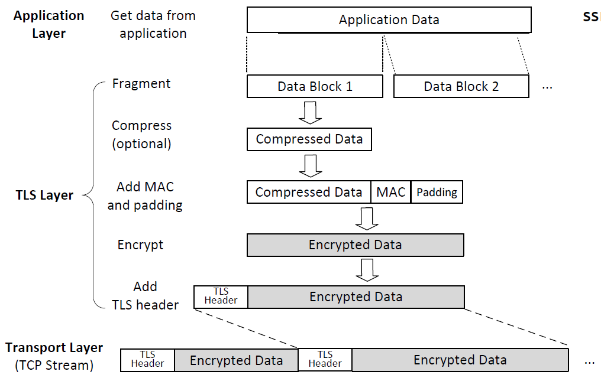
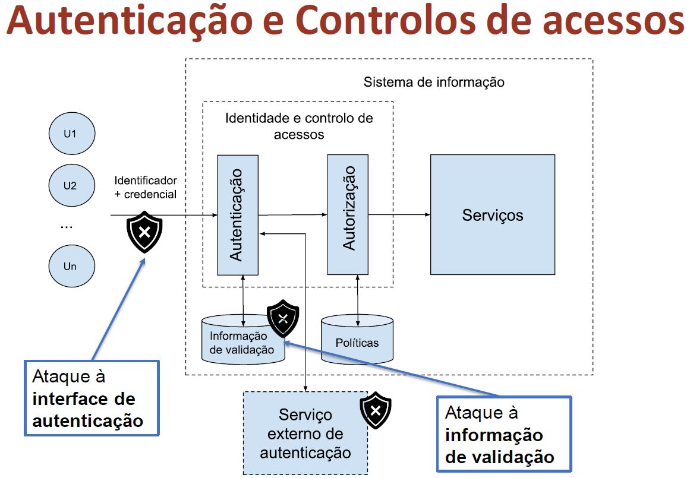
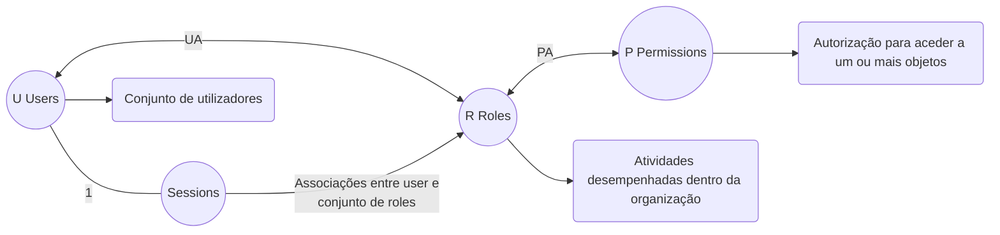
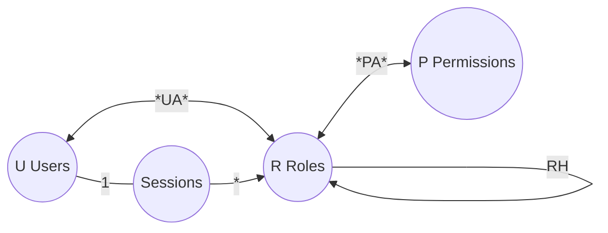
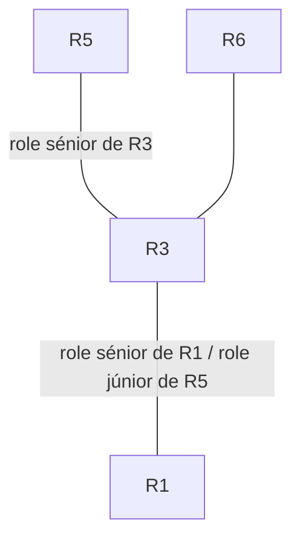
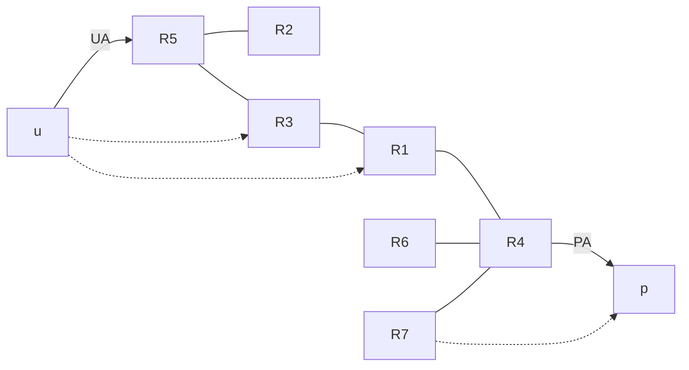
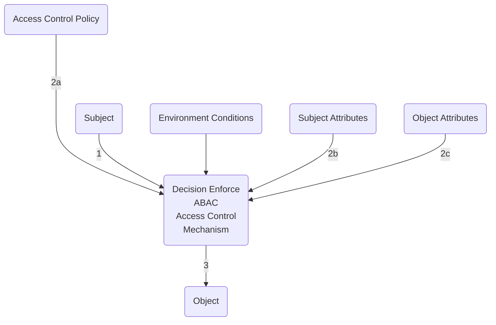

# Época Especial Segurança Informática

---

# Transport Layer Security

## Protocolo criptográfico

SSL - Secure Sockets Layer

TLS - Transport Layer Security

## Objetivos do protocolo SSL/TLS

- O Transport Layer Security (TLS) é um protocolo que fornece um canal seguro entre dois _endpoints_. O canal seguro tem 3 propriedades:

  - Confidencialidade: ninguém além dos _endpoints_ pode ver o conteúdo dos dados transmitidos
  - Integridade: podem ser detetadas quaisquer alterações feitas nos dados durante a transmissão
  - Autenticação: pelo menos um _endpoint_ do canal precisa ser autenticado para que o outro _endpoint_ tenha garantias sobre a quem está ligado.
Endpoint                         Endpoint
|client|<--|Secure Connection|-->|server|

## Camada TLS

- TLS fica entre a camada de transporte e aplicação
  - Os dados não protegidos são fornecidos ao TLS pela camada de aplicação
  - O TLS cifra e autentica os dados que envia/recebe da camada de transporte
  - O TLS requer uma camada de transporte fiável (TCP)

|Application Layer|
|TLS Layer|
|Transport Layer (TCP Protocol)|
|Network Layer (IP Protocol)|
|Data Link Layer|
|Physical Layer|

## Sub-protocolos

- Dividido em dois sub-protocolos principais
- _Record protocol_
  - Requer um protocolo de transporte confiável
- Handshake protocol
  - Lida com a criação e gestão de conexão segura, ou seja, o estabelecimento seguro dos parâmetros criptográficos do _record protocol_

## Record Protocol

- Fragmenta, comprime, autentica (MAC) e depois cifra
- A mesma ligação TCP, duas direções independentes de dados
  - Chaves, IVs e numero de sequência diferentes (client write e server write)

byte stream                                         byte stream
Fragment                                            Recombine
Compression                                         Decompression
MAC generation  Client write MAC Key + Seq          MAC verification
Encryption      Client write Key + IV               Decryption
|                                                   |
---------------------------------------------------->

### Detalhe do record protocol



### Notas sobre o record protocol

- Repetições de mensagens
  - Detetado pelo número de sequência
- Reflexão da mensagem
  - Chaves MAC separadas para cada direção
- Reutilização de _keystream_ (criptografia simétrica baseada em streams)
  - Chaves de criptografia e IVs separados para cada direção
- Análise de tráfego
  - Chaves de criptografia separadas

## Esquemas criptográficos

- Os esquemas criptográficos usados dependem do cipher suite acordado
- O cipher suite e os algoritmos de compressão são negociados pelo protocolo de handshake

- Exemplos
  - TLS_NULL_WITH_NULL_NULL
  - TLS_RSA_WITH_3DES_EDE_CBC_SHA
  - TLS_RSA_WITH_RC4_128_SHA
- Um cipher suite define
  - A função de hash usada pelo HMAC (e.g. SHA)
  - O esquema simétrico (e.g. 3DES_EDE_CBC or RC4_128)
    - Suporta modos de bloco ou stream
  - Esquema de estabelecimento de chaves (RSA or DH)

## Handshake protocol

- Responsável por:
  - Negociação dos parâmetros de operação
  - Autenticação dos _endpoints_
  - Estabelecimento de chave segura
- Autenticação de _endpoint_ e estabelecimento de chave
  - A autenticação é opcional em ambas as extremidades
  - Suporta várias técnicas criptográficas:
    - Transporte de chave (por exemplo, RSA)
    - Acordo de chave (por exemplo, DH)
- Cenário típico na internet (HTTPS)
  - Transporte de chave baseado em RSA usando certificados X.509
  - Autenticação de servidor obrigatória
  - Autenticação de cliente opcional

### Handshake Protocol: resumo

- Quando é usado RSA para transporte de chave
  - C<-->S: negociação dos algoritmos a serem usados
  - C<-->S: certificado de servidor
  - C<-->S: segredo aleatório cifrado com a chave pública do servidor
  - C<-->S: prova de posse do segredo aleatório
- Se for necessário autenticação de cliente
  - C<-->S: O servidor solicita o certificado de cliente
  - C<-->S: certificado de cliente
  - C<-->S: prova de posse da chave privada, assinando as mensagens anteriores

### Handshake Protocol (1): RSA based

ClientHello - C<-->S: client capabilities
ServerHello - C<-->S: parameter definitions
Certificate - C<-->S: server certificate (KeS)
CertificateRequest - C<-->S: Trusted CAs
ServerHelloDone - C<-->S: synchronization
Certificate - C<-->S: client certificate (KvC)
ClientKeyExchange - C<-->S: Enc(KeS: pre_master_secret)
CertificateVerify - C<-->S: Sign(KsC: handshake_messages)
ChangeCipherSpec - C<-->S: record protocol parameters change
Finished - C<-->S: {HMAC(master_secret, handshake_messages)}
ChangeCipherSpec - C<-->S: record protocol parameters change
Finished - C<-->S: {HMAC(master_secret, handshake_messages)}
ChangeCipherSpec - C<-->S: record protocol parameters change
Finished - C<-->S: {HMAC(master_secret, handshake_messages)}

## Protocolo HTTPS

- HTTP sobre TLS
- Porta por omissão: 433
- Verificar entre o URI e o certificado
  - extensão subjectAltName do tipo dNSName (se existir)
  - o campo Common Name no campo Subject field

- Demonstração
- HTTPS
- Repositório com raízes de confiança
- Ataques

## Derivação de chaves

ClientHello.random  premaster secret    ServerHello.random
                    Hash
                    master secret
                    Hash
                    |
                    Keys and IVs

### Alteração e repetição de mensagens de handshake

- Alteração de mensagens de _handshake_ é detetado com a mensagem __Finished__
  - A mensagem Finished garante que ambos os endpoints recebem a mesma mensagem

- Repetição de mensagens de Handshake
  - ClientHello and ServerHello contém valores aleatórios, diferentes para cada handshake
  - Implica que a mensagem __Finished__ é diferente para cada _handshake_

## Perfect forward secrecy

- A troca de chaves com RSA implica que o browser usa a chave pública do servidor para cifrar o _pre master secret_
  - O servidor decifra o _pre master secret_ usando a chave privada
- Este processo é seguro e garante confidencialidade do _pre master secret_
- O que acontece se a chave privada for comprometida?
  - O pre master secret dos handshakes seguintes e dos anteriores (guardados pelo atacante) podem ser decifrados
- Perfect forward secrecy é a propriedade do handshake que garante que, se a chave privada for comprometida, não é possível decifrar master secret anteriores (e consequentemente não é possível decifrar mensagens do record protocol)

## Master Secret baseado em Diffie-Hellman

- Cliente e servidor escolhem parâmetros p e g
- Servidor:
  - Escolhe a e calcula Y=g^a mod p
  - Envia Y, Sign(KsB)(Y)
- Cliente:
  - Escolhe b calcula e envia X=g^b mod p
  - Computes Y^b mod p = g^ab mod p = Z <Pre master secret>
- Servidor:
  - Calcula X^a mod p = g^ab mod p = Z <Pre master secret>
- O atacante conhece p, g e vê g^a mod p, g^b mod p
- É computacionalmente difícil determinar a e b

## Ataques a autoridades de certificação

- A validação do certificado do servidor depende de uma raiz de confiança
- As raízes de confiança são certificados emitidos por autoridades de certificação
- A autoridade de certificação Diginotar foi comprometida em 2011 e o atacante conseguiu emitir um certificado para serviços Google
- Um ataque de man-in-the-middle substituiu o certificado do Gmail pelo novo certificado, conseguindo ver mensagens sem quebrar o TLS

## Sockets TLS em Java

### Sockets e fábricas de sockets

- Os sockets regulares podem ser instanciados através de classes fábrica
- Instâncias ServerSocket e Socket são criadas por ServerSocketFactory e SocketFactory instances

### Funcionalidade

- SSLSocketFactory and SSLServerSocketFactory
  - Obtenção de cipher suites suportados por missão
  - Criação de instâncias de sockets
- SSLSocket and SSLServerSocket:
  - Inicia o handshake e recebe notificações da sua conclusão
  - Define the enabled protocols (SSL v3.0, TLS v1.0) and enabled cipher suites
  - Accept/require client authentication
  - Obtain the negotiated session
- SSLSession
  - Obtain the negotiated cipher suite
  - Get the authenticated peer identity and certificate chain

### Arquitetura baseada em fábrica de objetos

### Raízes de confiança por omissão em Java

```java
public class SSLDemo{
    public static void main(String[] args) throws IOException{
        SSLSocketFactory sslFactory = HttpsURLConnection.getDefaultSSLSocketFactory();
        SSLSocket client = (SSLSocket) sslFactory.createSocket("docs.oracle.com", 433);
        client.startHandshake();
        SSLSession session = client.getSession();
        System.out.println(session.getCipherSuite());
        System.out.println(session.getPeerCertificates()[0]);
        client.close();
    }
}
```

---

## Autenticação baseada em passwords

### Identificação e Autenticação

- Autenticação é o processo de verificação duma alegada identidade
- Motivação
  - Parâmetro para as decisões de controlo de acessos
  - Parâmetro para as ações de personalização
  - Informação de auditoria
- Exemplo
  - "user" + "password"
  - "user" - identificação
  - "password" - autenticação

### Informação de autenticação

- "Algo" que se conhece
  - "Passwords" e "passphrases"
- "Algo" que se possui
  - Ex.: "tokens" criptográficos, RSA SecurId
- "Algo" que se é
  - Ex.: características biométricas
- "Algo" que se faz
  - Ex.: assinatura manual

### Autenticação e Controlos de acessos



### Vulnerabilidades de passwords textuais

- Ataques de dicionário à palavra-passe

  - Atacante usa uma lista de palavras-passe conhecidas, ou prováveis, e tenta exaustivamente as entradas da lista, em 1 ou mais utilizadores

  - Estes ataques têm como alvo a interface de autenticação dos sistemas ou o local onde está guardada a informação de validação

## Sistema de autenticação

- Formalização
  - Conjunto A de informação de autenticação
  - Conjunto V de informação de validação
  - Função f: A->V
  - Função g: V->A->{true,false}
- Exemplo
  - f(a)=H(a)
  - g(v)(a) = (v=H(a))

Sujeito             Sistema
a   ->      f ->    v
a   ->              g -> {true,false}

## Ataques de dicionário

- Ataques do tipo 1
  - Entrada: informação de validação - v
  - Saída: informação de autenticação
  - Para cada a' pertencente a __Dicionário__
    - Se f(a')=v retornar a'
  - Retornar "falha"
- Ataques do tipo 2
  - Entrada: função de autenticação - __g(v)__
  - Saída: informação de autenticação
  - Para cada __a'__ pertencente a __Dicionário__
    - Se g(v)(a') = true retornar a'
  - Retornar "falha"

### Proteção contra ataques de dicionário

- Aumentar a incerteza da "password"
  - Passwords aleatórias
  - Seleção proativa
  - Verificação _offline_
- Controlar o acesso à informação de verificação
- Aumentar o tempo de processamento da função __f__
  - __f=H__, onde __H__ é uma função de _hash_
  - Solução: __f=H^R__
- Aumentar o tempo de processamento ou limitar o acesso à função __g(v)__

## Ataques com pré-computação

- Baseai-se no facto da função f ser igual para todos os utilizadores
- Seja D um dicionário de palavras prováveis e M um array associativo
- Pré-computação
  - Para todos a'i em D, calcular e armazenar o par (f(a'i),a'i) em M (tal que M[f(a'i)]=a'i)
- Ataque
  - Dado v, retornar M[v]
- A pré-computação é usada para obter a "password" de qualquer utilizador

## Proteção: "salt"

- Proteção contra ataques de dicionário descritos anteriormente
- Solução: torna a função f diferente para cada utilizador
- Exemplo: __fU(a)=H(saltU|a)__, onde
  - __fU__ é a função associada ao utilizador U
  - __saltU__ é uma sequência de "bytes" gerada aleatoriamente para cada utilizador
- Neste cenário, a pré-computação depende de __salt__
  - é específica de cada utilizador do sistema
  - Não pode ser utilizada para atacar todos os utilizadores do sistema

## Proteção contra ataques tipo 2

- Limitar o acesso à função de autenticação g(v) após a deteção de tentativas de autenticação erradas
- Técnicas
  - Backoff
    - O tempo de execução de g(v) depende do número anterior de tentativas erradas
  - Terminação da ligação
    - Terminação da ligação em caso de erro
  - Bloqueamento
         Bloqueamento da função g(v) após um número de tentativas erradas
  - Jailing
    - Acesso ao serviço com funcionalidade limitada
- Problema: garantir disponibilidade do serviço

## Aumentar o custo dos pedidos

- Diminuir o número de pedidos realizados através do aumento do seu custo para o cliente
- Desafio computacional que tem de ser calculado pelo "user-agent" cliente antes da realização do pedido
  - Necessita de computação do lado do cliente (ex. Javascript)
- CAPTCHA- "Completely Automated Public Turing Test to Tell Computers and Humans Apart" - <http://captcha.net/>
  - Fácil para humanos
  - Difícil para computadores

---

# Autenticação em aplicações Web

- Revisão do protocolo HTTP
- Cookies
- Headers de autenticação
- Autenticadores

## Hypertext Transfer Protocol (HTTP)

- Objetivo original: Transferir documentos em hiper-texto (HTML)
- Evolução do protocolo coordenada pelo W3C
  - RFC 1945 - Versão 1.0
  - RFC 2616 - Versão 1.1
  - RFC 7540 - Versão 2 (binário e múltiplos pedidos na mesma ligação)
- Principais características: sem estado (stateless) mas com possibilidade de manter sessões
- Servidor recebe pedidos TCP no porto 80 (por omissão)

User Agent                  --Pedido(GET, POST, ...)--> SERVER
(por exemplo, Web Browser)  <--Resposta--               SERVER

### Pedidos HTTP

| Tipos de pedidos (Request Methods) | Descrição |
|------------------------------------|-----------|
| GET | Pedido para obter a representação de um recurso (método mais comum).|
| HEAD | Pedido idêntico ao GET mas o corpo da resposta não é enviado (apenas os headers) |
| POST | Envio de dados para um recurso. Os dados vão o corpo do pedido. |

- Outros tipos de pedidos: PUT, DELETE, TRACE, OPTIONS

## Formato de um pedido HTTP

Exemplo com GET

<_Método_> <_URI_> HTTP/1.1 -> [GET /cidade HTTP/1.1]

<_Cabeçalhos_> [User-Agent: curl/7.16.3 libcurl/7.16.3 Host: www.lisboa.pt Accept-Language: pt, en]

|Linha em branco|

<_Dados_> |No caso do método GET a zona dos dados não é usada|

Client Web Browser ----> Server

## Formato de uma resposta HTTP

Exemplo de resposta

| HTTP/1.1 <_code_> <_texto_> | -> [HTTP/1.1 200 OK]

<_Cabeçalhos_> [Date: Mon, 27 Jul 2009 ... Server: Apache Last-Modified: Wed, 22 Jul 2009 ... Content-Type: text/plain]

<_Dados_> [Hello World!]

Client Web Browser <---- Server

## Cabeçalhos (alguns exemplos)

- Nos pedidos e respostas está previsto o uso de cabeçalhos para transportar informação adicional sobre o pedido/resposta

|  | POST /cidade HTTP/1.1 |
|--|-----------------------|
| Tipo de aplicação usada para fazer o pedido | User-Agent: curl/7.16.3 libcurl/7.16.3 |
| Nome do servidor | Host: <www.lisboa.pt> |
| Lingua preferencial para receber a resposta | Accept-Language: pt, en |
| Tipo/Estrutura do conteúdo | Content-Type: application/json |

## Códigos de resposta (alguns exemplos)

- 1xx - Informação
- 2xx - Sucesso
  - 200 OK
  - 204 No Content
- 3xx - Redirecionamento
  - 302 Found
- 4xx - Erro de cliente
  - 400 Bad Request
- 5xx - Erro de servidor
  - 500 Internal server Error

### Resposta Redirect

- A redireção é desencadeada pelo servidor enviando um código de resposta 3xx. header de Location referindo o URL que o user-agent deve pedir

|Client Web Browser|  | Server |
|------------------|--|--------|
| Pedido inicial | -GET /doc HTTP/1.1-> | Server |
|  | <-HTTP/1.1 301 Moved Location: /doc_new- | Server |
| Pedido à nova localização | -GET /doc_new HTTP/1.1-> | Server |
|  | <-HTTP/1.1 200 OK- | Server |

### Manutenção de estado em aplicações Web

- O protocolo HTTP é _stateless_
  - Os pedidos são independentes e sem relação (mesmo pedidos consecutivos do mesmo cliente na mesma ligação TCP)
- Como manter uma conversação entre o cliente e o servidor em HTTP?
  - Utilizam-se HTTP Cookies

|  |
|-|
| RFC 2965: HTTP State Management Mechanism |
| RFC 2964: Use of HTTP State Management |

## Cookie HTTP

- O que são Cookies?
  - Mecanismo que fornece a aplicações HTTP servidoras suporte para guardar e obter informações sobre o cliente
  - Manutenção de informação de estado sobre o cliente
- Que informação contém um Cookie?
  - Informação sobre o estado do cliente na forma de par _nome=valor_
  - "Range" de URLs para o qual o estado é válido
  - Data de validade (para o caso de Cookies persistentes)
- Utilizadores através dos headers HTTP

### Utilizações habituais de Cookies

- Podem ser utilizados para:
  - Criar sessões (conversação)
  - Evitar login (login automático)
  - Deixar registo de navegação (incluindo third-party cookies)
  - Deixar registo de preferências do cliente
- Não podem (não é possível) ser utilizados para:
  - Aceder ao disco rígido
  - Enviar vírus para o cliente

## Cookies

- No protocolo HTTP cada pedido é independente do anterior
- No entanto, uma das forma da aplicação web manter um contexto com o utilizador é através de cookies (usando cabeçalhos de resposta e pedido)

| | | |
|-|-|-|
| | POST /login | |
|Client Web Browser| -data-> |aplicação web|
| | <-HTTP/1.1 200 OK | |
| session=xyzw | Set-Cookie: session=xyzw | |

- Cada vez que é feito um pedido a uma aplicação, o browser envia automaticamente os cookies que tiver para essa aplicação
  - O cookie fica associado a um domínio (ex:www.mysite.com) e um caminho dentro desse domínio (ex: / ou /some/path)

| | | |
|-|-|-|
| | GET /MyProducts | |
|Client Web Browser| -Cookie: session=xyzw-> |aplicação web|
| | <-HTTP/1.1 200 OK | |
| session=xyzw | | |

### Headers HTTP referentes aos Cookies

- Sintaxe do header 'Cookie' no pedido HTTP

Cookie: {<__NAME__>=<__VALUES__>;}+

Sintaxe do header 'Set-Cookie' na resposta HTTP

Set-Cookie: {<__NAME__>=<__VALUES__>;}+ [expires=<__DATE__>;]
[path=<__PATH__>;] [domain=<__DOMAIN_NAME__>;] [secure] [httpOnly]

### Algumas notas sobre Cookies

- Uma resposta HTTP pode conter múltiplos cabeçalhos Set-Cookie
- O campo expires indica ao cliente quando o Cookie "deve" ser removido
  - No entanto o cliente não é obrigado a removê-lo
  - O cliente pode remover o Cookie antes deste expirar se o número de Cookies exceder os limites internos do cliente
- Para uma aplicação servidora __apagar um Cookie__ no cliente, deverá enviar na resposta um Cookie com o mesmo nome e uma data de expiração passada

---

# Autenticadores

## Fases de autenticação

- O esquema de autenticação do HTTP não resolve a manutenção do estado de autenticação
  - O browser tem de guardar a password ou pedi-la em cada pedido
  - O servidor tem de validar a password em cada pedido
- Alternativa: usar __autenticadores__

- Duas fases na autenticação
- Fase 1
  - Apresentação das credenciais pelo utilizador (ex.: "username+password")
  - Obtenção dum autenticador
- Fase 2
  - Apresentação do autenticador automaticamente pelo "user-agent"

## Objetivos do atacante

- Falsificação existencial
  - Obter um autenticador válido
- Falsificação seletiva
  - Dado um utilizador, obter um autenticador válido para esse utilizador
- Obtenção da chave usada na criação de autenticadores

### Exemplos de Autenticador: cookie

Utilizador passa por um processo de registo onde escolhe nome de utilizador e password

| | | |
|-|-|-|
| Browser | | Aplicação web |
| | -Login com (user, password)-> | |
| Cookie | <-Cookie- | Validação de password |
| | Pedido+Cookie | |
| | Resposta | Validação de cookie |

Aplicação web guarda numa base de dados a password (representante) de cada utilizador

### Autenticadores com cookies: implementação

- Identificador de sessão
  - Informação sobre a sessão presente no servidor
  - "Cookie" contém o identificador para aceder a essa informação
  - Deve ser computacionalmente infazível criar um identificador válido
    - Geração criptográfica de números aleatórios
- Message Authentication Code
  - Informação sobre a sessão presente no cookie
  - Cookie protegido por um MAC
  - Se a confidencialidade for requisito, cifrar o conteúdo do cookie
- Mecanismo de validade temporal próprio
  - Não utilizar o mecanismo dos cookie
  - Limite da validade temporal
    - Presente na informação de sessão
    - Presente no cookie (protegido por esquema MAC)
- Logout/Revogação
  - Invalidar a sessão
  - Colocar o cookie numa lista de revogação (até à expiração da validade)
- Proteção dos cookies
  - Proteção do transporte através de SSL (Uso da opção flag Secure)
  - Proteção no cliente - flag HttpOnly

## Cookies e segurança

- A aplicação web valida o acesso com base na autenticidade dos cookie
- A falsificação de um pedido que mude o estado da aplicação pode ser feita usando pedidos cross-site
  - Problema conhecido como Cross-Site Request Forgery

|Domínio B|   -> Aplicação web A do atacante
|Key=value|   -> Aplicação web B vulnerável

- Para evitar este problema, a opção SameSite=Strict garante que cookies marcados com esta opção não são usados em pedidos de cross-site

### Exemplo de Autenticador: token

O sistema cliente usa com _token_ obtido previamente

1- Utilizador autentica-se e obtém um token -> Sistema de Autenticação
2- Sistema de Autenticação -> Utilizador
3- Utilizador -token-> Aplicação cliente

| | | |
|-|-|-|
|Aplicação cliente||Aplicação web + Base de dados <-validação->|
||-Pedido+token->||
||<-Resposta-|validação|
||-Pedido+token->||
||<-Resposta-|validação|

Aplicação web guarda e valida tokens usados por sistemas cliente

## Autenticação "basic" em HTTP

- O protocolo HTTP não possui estado
  - a autenticação tem de ser realizada em todos os pedidos
- Dois esquemas de autenticação definidos no RFC 2617 - _basic_ e _digest authentication_
- Fluxo de autenticação - _basic authentication_
  - Cliente acede a recurso protegido
  - Servidor responde com 401 e response header WWW-Authenticate
  - Cliente acede ao recurso usando o header Authorization com a codificação base 64 do utilizador e password

Na maior parte dos casos é usado apenas esta interação, com valores no Authorization definidos pela aplicação web

| | |
|-|-|
| C->S | GET /docu2.html HTTP/1.1|
| C<-S | HTTP/1.1 401 Unauthorized WWW-Authenticate: Basic realm="<testrealm@host.com>"|
| C->S | GET /docu2.html HTTP/1.1 Authorization: Basic <base 64 of userid ":" password>|

### Autenticadores JWT

|Encoded|
|-|
|Header + "."|
|Payload + "."|
|Signature|

|Decoded| |
|-|-|
|Header: Algorithm & Token Type|{"alg":"HS256","typ":"JWT"}|
|Payload: Data|{"sub":"1234567890","name":"John Doe","iat":1516239022}|
|Verify Signature|HMACSHA256{base64UrlEncode(header)+"."+base64UrlEncode(payload),your-256-bit-secret}secret base64encoded|

[JWT](https://jwt.io/)

---

# OpenID Connect

- Introdução ao protocolo para a delegação de autenticação em ambientes web

## Participantes

- Utilizador (End-User)
  - Utilizador humano que pretende aceder a um serviço na aplicação cliente
  - A aplicação cliente apenas fornece o serviço a utilizadores autenticados
  - Caso prático com utilizador a aceder via browser
- Aplicação cliente (Relying Party)
  - Aplicação cliente que fornece o serviço
  - Delega no fornecedor de identidade a autenticação do utilizador
- Fornecedor de identidade (Identity Provider)
  - Guarda registo do utilizador e da sua informação de autenticação (password, certificado, ...)
  - Guarda registo de aplicações cliente que pretendam autenticar utilizadores

## Visão geral dos passos do protocolo

```
+---------------+                                   +-----------+
|               |                                   |           |
|               |-------(1) AuthN Request---------->|           |
|               |   +----+                          |           |
|               |   |End-| <--(2) AuthN & AuthZ---->|           |
|   RP          |   |User|                          |   OP      |
|               |   +----+                          |           |
|               |                                   |           |
|               |<---(3) AuthN Response-------------|           |
|               |----(4) UserInfo Request---------->|           |
|               |<---(5) UserInfo Response----------|           |
|               |                                   |           |
+---------------+                                   +-----------+
```

## Fluxo do tipo authorization code

|Browser|Client(app web)|Ex: Google, Github, Auth0, ...|
|-|-|-|
|-Login start->|||
|<-302 Redirect to authorization endpoint+scope=openid-|||
|Get authorization endpoint+scope=openid-|-------------->|Authorization server Authorization endpoint|
|<--|--|-->|
|<-302 Redirect callback URL+code|---------------|Authorization server Authorization endpoint|
|-GET callback+code->|||
||-POST /token +code+client_id+client_secret->|Token endpoint|
||<-Access Token + ID Token-|Token endpoint|
|Login end Authenticator (ex: userid+hmac)|-GET /user_info+access token->|UserInfo Endpoint|
||<-User Info-|UserInfo Endpoint|
||Uid:access token/id token / user info||

## ID Token

- Um ID token é um conjunto de asserções sobre um utilizador autenticado
- JSON Web Token (JWT) assinado pelo fornecedor de identidade
  - Emissor do token
  - Sujeito que o token representa
  - audience tem valor do client_id no Relying Party
  - Momento a partir do qual o ID Token já não pode ser aceite
  - Momento em que o JWT foi assinado (desde a Epoch, 1970-01-01)

## Recurso UserInfo

- A informação sobre um utilizador autenticado pode ser obtida através do UserInfo Endpoint
- Representada através de um objeto JSON
  - se assinada/cifrada será um JWT [5]
- Exemplo com UserInfo endpoint
    <https://www.googleapis.com/oauth2/v3/userinfo>

```json
{
    "family_name":"Surname",
    "name":"Alice",
    "picture":"...",
    "email": "alice@gmail.com",
    "gender": "female",
    "link": "https://plus.google.com/...",
    "given_name": "Alice",
    "id": "100...2243139"
}
```

## Obter client-id e client-secret (1)

---

# OAuth 2.0

- Sumário
  - Motivação para a framework OAUTH 2.0
  - Fluxos de autorização na framework OAuth 2.0
  - Exemplo com o Google OAuth 2.0 playground
  - Relação com OpenID Connect

## Motivação para a framework OAuth 2.0

- "A Alice quer encomendar a impressão de algumas fotos que tem no site myphotos.com usando o serviço de impressão do site printonline.com"
- No cenário tradicional, o cliente (printonline.com) teria de se autenticar no servidor de recursos (myphotos.com) usando as credenciais da Alice
  - Problemas: Posse de credenciais, Acesso total às fotos, Impossibilidade de revogar acesso
- A framework OAuth 2.0 tem como objetivo delegar autorização condicionada
  - O dono de recurso autoriza o acesso temporário a um conjunto pré-determinado de recursos

## Papéis

- Proprietário do recurso (Resource owner)
  - Uma entidade capaz de conceder acesso a um recurso protegido
  - Quando o proprietário de recurso é uma pessoa, é referenciado como um end-user
- Servidor de recurso (Resource server)
  - O servidor hospeda recursos protegidos, capaz de aceitar e responder a requisições de recursos protegidos usando access tokens
- Client (Client)
  - Uma aplicação que requisita recursos protegidos através do proprietário de recurso e com sua autorização
- Servidor de autorização (Authorization server)
  - O servidor que emite access tokens ao cliente depois de autenticar com sucesso o proprietário de recurso e obter autorização

## Aplicações cliente

- A framework OAuth tem como objetivo ser utilizada por diferentes classes de aplicações
  - Aplicações web clássicas, a correr num servidor HTTP
  - Aplicações web a correr maioritariamente no browser com tecnologias JavaScript
  - Aplicações nativas, em particular as aplicações móveis
- Os clientes têm de se registar no servidor de autorização, sendo-lhes atribuído um client_id. Para alguns é também atribuído um client_secret, usado pelo cliente no servidor de autorização
- Dois tipos de clientes, em função de conseguir guardar ou não o client_secret
  - Confidenciais
  - Públicos

## Registo de clientes

- Apenas clientes registados podem aceder a recursos controlados pelo servidor de autorização
  - Imposição de limites
  - Auditoria
- A forma como o registo é feito depende do fornecedor
  - Ex: O responsável pelo cliente faz o registo através de um formulário do servidor de recursos

## Acesso a recursos protegidos (I)

- O access token representa uma credencial de acesso
  - Os clientes acedem aos recursos protegidos indicando um access token
  - O servidor de recursos usa-o para aplicar políticas de acesso
  - São strings opacas para os clientes

|Aplicação Cliente||Servidor de recursos|
|-|-|-|
||-access_token->||
||<-Representação do recurso->||

- Exemplo de acesso a um recurso usando autenticação HTTP
  - GET <https://si.example.pt/resource> HTTP/1.1
  - Authorization: Bearer the.access.token
- A framework prevê quatro cenário (grant flows) para obtenção de um _access token_
  - Client Credentials, Resource owner password, Authorization code, Implicit
- Client credentials grant flow - Autorização é dada somente com base nas credenciais do cliente (client_id, client_secret), ou seja, não está envolvido nenhum utilizador

||||
|-|-|-|
|||Servidor de Autorização|
||-POST(client_id+client_secret)200(access_token,...)->|Token endpoint|
|Aplicação Cliente|-access_token Representação do recurso->|Servidor de recursos|

- Resource owner password credential grant - Autorização é dada com base na password do utilizador
  - A aplicação cliente não precisa de persistir a password
  - Deve apenas ser usado quando há um nível elevado de confiança entre o dono de recursos e a aplicação cliente (ex: cliente faz parte do sistema operativo)

||||
|-|-|-|
|||Servidor de Autorização|
||-POST(client authn, user+pwd)200(access_token,...)->|Token endpoint|
|password->Aplicação Cliente|-access_token Representação do recurso->|Servidor de recursos|

- Authorization code grant - código de autorização é obtido pelo dono de recursos e entregue ap cliente para que este obtenha o access_token
  - A password do dono de recursos não é visível para o cliente
  - Não define forma do dono de recursos se autenticar e dar consenso para o cliente aceder ao recurso

|||||
|-|-|-|-|
||-GET(response_type, client_id, redirect_uri, scope, state)-302(state,code)->||Servidor de Autorização|
|||-POST(client authn, code, ...)200(access_token,...)->|Token endpoint|
|User Agent|Aplicação Cliente|-access_token Representação do recurso->|Servidor de recursos|

## Mensagem para obtenção do access_token

- O access token é pedido através de um POST para o token endpoint
  - Parâmetros do pedido seguem no corpo de uma mensagem HTTP cujo content-type é application/x-www-form-urlencoded
  - Cada cenário prevê diferentes parametrizações
- Nos clientes confidenciais é usado o esquema Basic Authentication do HTTP
  - client_id e client_secret são o username e password, respetivamente

## Access tokens: exemplos de pedidos

- Pedido com Resource Owner Password Credentials Grant

```
POST /token HTTP/1.1
Host: server.example.com
Authorization: Basic ASD3asd4ASD5
Content-Type: application/x-www-form-urlencoded

grant_type=password&username=johndoe&password=A3ddj3w
```

- Pedido com Authorization Code Grant

```
POST /token HTTP/1.1
Host: server.example.com
Authorization: Basic asdASD3asd
Content-Type: application/x-www-form-urlencoded

grant_type=authorization_code&code=Splx10asd&redirect_uri=https%3A
```

## Access tokens: exemplo de resposta

```
HTTP/1.1 200 OK
Content-Type: application/json;charset=UTF-8
Cache-Control: no-store
```

```json
{
    "access_token":"asd3asd4ASD",
    "token_type":"example",
    "expires_in":3600,
    "refresh_token":"tgzv3JKDM",
    "example_parameter":"example_value"
}
```

## Detalhes sobre o Authorization code grant

```
GET /authorize?response_type=code&scope=abc
client_id=sb6BR&state=xyz&redirect_uri=https%32F
HTTP/1.1 Host: server.example.com
```

User Agent -> |Servidor de Autorização|Authorization endpoint

- Usando mecanismos definidos fora da framework OAuth 2.0, o dono de recursos autentica-se e consente que a aplicação cliente aceda aos recursos

User Agent -authentication and consent protocol-> |Servidor de Autorização|Authorization endpoint

- Token de autorização (code) é entregue à aplicação cliente por redireção do user-agent

User Agent

```
HTTP/1.1 302
Found Location:
https://client.example.com/cb?code=Splx10Be&state=xyz
```

Authorization endpoint

| | | | |
|-|-|-|-|
|-User Agent->|||Authorization endpoint|
|-User Agent->|-Aplicação cliente->|-POST (client authn, grant info) 200 (access_token, ...)->|Token endpoint|
||-Aplicação cliente->|-access_token Representação do recurso->|Servidor de recursos|

## Detalhes sobre o Implicit grant

- Token de autorização (code) é entregue à aplicação cliente por redireção do user-agent

HTTP/1.1 302
Location:
<http://example.com/cb/#access_token=2YotnasASFADSFasd&state=xyz&token_type=example&expires_in=3600>

## Scopes

- Representam o tipo de autorização que está a ser pedido a determinado recurso
- Cada scope é uma string. Cada pedido de autorização contém zero ou mais scopes
- Exemplos
  - (Google tasks) <https://www.googleapis.com/auth/tasks>
  - (Github) user: email+public_repo

GET /authorize?
response_type=code&client_id=s6GHjfDFS&state=xyz&redirect_uri=https%3A%2F%2Fclient%2Eexample%2Ecom%&scope=https%3A%2F%2Fwww.googleapis.com%2Fauth%2Ftasks
HTTP/1.1 Host: server.example.com

## Access token e Refresh token

- O Access token representa as credenciais para aceder a recursos protegidos
  - String opaca para os clientes, representando scopes específicos e duração de acesso
  - É emitido pelo servidor de autorização e validado pelo servidor de recursos. Ambos os servidores de recursos e de autorização precisam de conhecer a estrutura interna do token e o que representa
  - Tem a vantagem do servidor de recursos não precisa de saber lidar com um conjunto diversificado de mecanismos de autenticação
  - Formato, estrutura e métodos de utilização podem variar
- Opcionalmente, o Authorization Server entrega também um refresh token usado para pedir novas credenciais de acesso

## Front channel e Back channel

- Front channel
  - Termo usado para designar o canal de comunicação client <-> Authorization endpoint, via redireção do user-agent
  - Em caso de erro a resposta tem sempre de ser entregue via redirect (não podem ser usados os códigos de erro)
  - O _client_secret_ nunca passa pelo front channel
  - Usando o front channel como é que o cliente estabelece uma relação entre pedido e resposta?
    - Parâmetros state
- Back channel
  - Termo usado para designar o canal de comunicação cliente <-> Token endpoint
  - Usa mensagem POST HTTP e os respetivos códigos de erro
  - HTTP Basic authentication com _username_ (client_id) e password (client_secret)

## Authorization code grant: outra visão

|Browser| |Client (app web)| |Authorization server|
|-|-|-|-|-|
| |-GET service->||||
||<-302 Redirect to authorization endpoint + scope-||
||-GET authorization|endpoint+|scope->|Authorization endpoint|
||<-|-|->|Authorization endpoint|
||<-|302 Redirect|callback URL + code-|Authorization endpoint|
||-GET callback + code->||||
||||-POST /token+ code + client_id + client_secret->|Token endpoint|
||||<- access token-|Token endpoint|
||||-GET /resource + access token->|Resource server|
||<-Service data-||<-Data-|Resource server|

## Ameaças e recomendações (alguns exemplos)

- Premissas gerais
  - Atacante tem acesso total à rede entre o utilizador e servidor de autorização.
  - Atacante não tem acesso à rede entre servidor de autorização e servidor de recursos
  - O cliente e o servidor de autorização podem conluio
- Servidor de autorização
  - Rotação de refresh tokens para quem em caso de perda fiquem inválidos
  - Validação do redirect_uri para evitar falsos clientes
- Cliente
  - Não armazenar credenciais no código ou em recursos da aplicação
  - Guardar credenciais (client secret) em local seguro
  - Ligar o parâmetro __state__ ao user-agent que fez o pedido

---

# OpenID Connect

- O protocolo OpenID Connect (core specification) fornece dois serviços
  - Autenticação do utilizador, através de um conjunto assinado de asserções (id_token)
  - Acesso a informação adicional sobre o utilizador indicando o access token
- O OpenID Connect acrescenta uma camada de identidade ao OAuth 2.0

```
                        Fornecedor de identidade
    +---<---------------Servidor de autorização
    |   code    Consumidor de identidade (Relying party)
Sujeito ->  Cliente ->  Servidor de recursos
            |               |
            +---------------+
                User info
```

## Obtenção do ID Token pela aplicação cliente

## ID Token

- Um ID Token é um conjunto de asserções sobre um utilizador autenticado
- JSON Web Token assinado pelo fornecedor de identidade

```json
{
    "iss":"",   // Emissor do token
    "sub":"",   // Sujeito que o token representa
    "aud":"",   // audience tem valor do client_id no Relying Party
    "nonce":"",
    "exp":"",   // Momento a partir do qual o ID Token já não pode ser aceite
    "iat":"",   // Momento em que o JWT foi assinado (desde a Epoch, 1970-01-01)
    "sub":"",
}
```

## Recurso UserInfo

- A informação sobre um utilizador autenticado pode ser obtida através do UserInfo Endpoint

- Representada através de um objeto JSON
  - se assinada/cifrada será um JWT
- Exemplo com UserInfo endpoint
<https://www.googleapis.com/oauth2/v3/userinfo>

```json
{
    "family_name": "Surname",
    "name": "Alice",
    "picture": "...",
    "email": "alice@gmail.com",
    "gender": "female",
    "link": "https://plus.google.com/ com/...",
    "given_name": "Alice",
    "id": "100..."
}
```

---

# Modelos e políticas para controlo de acessos

- Modelos Matriciais
- Modelos Role-based Access Control
- Biblioteca Casbin

## Agenda

- Modelos para controlo de acessos

- Controlo de acessos baseado em roles
- Família de modelos
  - Base: RBAC0
  - Hierarquia de roles: RBAC1
  - Restrições: RBAC2
  - Unificação: RBAC3
- Caso prático: Biblioteca [Casbin](https://casbin.org/)

## Monitor de referências

```
Subject -Operation-> |Policy Enforcement Point| --> Object Data/services
                                |
                                Policy Decision Point
```

- Propriedades do PEP:
  - Não deve ser possível alterá-lo
  - Não deve ser possível contorná-lo
  - Deve ser pequeno e estar confinado ao núcleo de segurança do sistema por forma a facilitar a verificação da sua correção

## Elementos do sistema de controlo de acessos

- Modelo de segurança: formalização da forma de aplicação das políticas de segurança

- Política de segurança: define as regras do controlo de acessos

- Mecanismos de segurança- software/hardware: funções de baixo nível que dão suporte à implementação de modelos e políticas de segurança

- PEP depende dos mecanismos de segurança
- PDP depende da política e modelo de segurança

## Modelo Matriz de Acessos

- Matriz de acessos define um triplo (S,O,A), onde:
  - S é o conjunto de sujeitos
  - O é o conjunto de objetos
  - A é o conjunto de operações
  - Mso é a matriz de operações, onde as linhas representam os sujeitos, as colunas os objetos e cada entrada M[s,o] as permissões do sujeito s sobre o objeto o.

| |File1|File2|File3|Program1|
|-|-|-|-|-|
|Alice|read/write|read/write|||execute|
|Bob|read||read/write||
|Charlie||read||execute/write|

## Implementação da matriz de acessos (1)

Tabela de autorização

|Sujeito|Permissão|Objeto|
|-|-|-|
|Alice|read|File1|
|Alice|write|File1|
|Alice|read|File2|
|Alice|write|File2|
|Alice|execute|Program1|
|Bob|read|File1|
|Bob|write|File3|
|Bob|read|File3|
|Charlie|read|File2|
|Charlie|execute|Program1|
|Charlie|write|Program1|

- _Capabilities_
  - As permissões são guardadas junto dos sujeitos
  - A capacidade (capability) de cada sujeito corresponde à sua linha na matriz:
    - Alice capability: File1: read, write; File2: read, write; Program1: execute
    - Bob capability: File1: read; File3: read, write
    - Charlie capability: File2: read; Program1: execute, write
  - Vantagens:
    - Facilidade na obtenção das permissões associadas a um sujeito
    - Em ambientes distribuídos elimina a necessidade de múltiplas autenticações
  - Desvantagens:
    - Para obter lista de acessos a objetos obriga a pesquisar todas as capacidades
    - Possibilidade de cópia e uso fraudulento

- _Access Control List (ACL)_

  - As permissões são guardadas junto dos objetos
  - A ACL de cada objeto corresponde à sua coluna na matriz:
    - ACL para File1: Alice: read, write; Bob: read
    - ACL para File2: Alice: read, write; Charlie: read
    - ACL para File3: Bob: read, write
    - ACL para Program1: Alice: execute, Charlie: execute, write
  - Vantagens:
    - Facilidade na obtenção das permissões associadas a um objeto
    - Ao eliminar um elimina-se todas as permissões a ele associadas
  - Desvantagens:
    - Para saber todas as permissões de um sujeito é necessário pesquisar todas as ACLs

## Permissões para grupos

- Motivação: facilitar a gestão de sujeitos, agrupando sujeitos com permissões semelhantes num grupo.
- Os grupos funcionam como uma camada intermédia na definição de controlos de acesso.
- As permissões podem ser associadas a grupos ou individualmente aos sujeitos.
- A verificação de controlo de acesso passa a ser feita também em função do sujeito ser membro ou não de um grupo.
- A verificação de controlo de acesso passa a ser feita também em função do sujeito ser membro ou não de um grupo.
- É possível usar permissões negativas para um determinado sujeito dentro de um grupo.

## Caso prático: Controlo de acessos em Windows

- Após login é atribuído ao utilizador um access token
  - Em cada access token estão presentes security identifiers (SID) com a identificação do utilizador e dos grupos a que pertence
- Após a criação de um objeto (recurso) é lhe associado um _security descriptor_ com:
  - O SID do seu dono
  - Discretionary Access Control List (DACL)
  - System Access Control List (SACL) com a política do sistema para auditar o acesso ao objeto e o "nível de integridade" do mesmo
- Uma ACL é uma lista de Access Control Entry (ACE), onde consta:
  - SID (utilizador ou grupo), Permissão ou Negação, Ações

## Controlo de acessos através de DACL

- Para determinar se o acesso é autorizado ou não, a DACL é percorrida até à negação de uma das ações ou permissão de todas as ações requeridas
- À cabeça ficam as ACE que negam


## Modelos RBAC - Motivação

- Para efeitos de controlo de acessos é mais relevante saber as responsabilidades do utilizador do quem ele é
- Nas organizações, as permissões estão tipicamente associadas a roles e não a pessoas
  - Funcionário da tesouraria; Diretor de departamento
- As permissões associadas a roles mudam com menos frequência do que a associações entre utilizadores e roles
- As organizações valorizam princípios como o da separação de poderes
  - e.g. Quem pede material para projetos não deve ser a mesma pessoa que autoriza o pagamento

## Família de modelos RBAC

- São quatro os modelos da família RBAC

```
                        RBAC3
Hierarquia de roles RBAC1   RBAC2   Restrições
                        RBAC0
            Base de qualquer sistema RBAC
```

- Servem de referência para caracterizar os sistemas que usam este tipo de controlo de acessos

## RBAC0



- As relações user assignment (UA) e permission assignment (PA) são base do modelo
  - Ambas são relações de muitos para muitos
- As políticas são expressas pela concretização destas relações
- As permissões são sempre positivas
- As permissões de um utilizador são a reunião das permissões dos roles ativos na sessão
  - Relação de um para um entre utilizadores e sessões
  - Relação de um para muitos entre sessões e roles
  - Cada utilizador ativa apenas o conjunto de roles que lhe interessa

## RBAC0 - Definições

- U, R, P e S (users, roles, permissions e sessions)
- UA <= U x R, relação de muitos para muitos entre users e roles
  - U = {u1,u2} R={r1,r2}
  - U x R = {(u1,r1),(u1,r2),(u2.r1),(u2,r2)}
- PA <= P x R, relação de muitos para muitos entre permissions e roles
- user: S -> U, função que associa cada sessão si a um utilizador user(si)(constante ao longo da sessão)
- roles:S -> 2^R, função que associa cada sessão si a um conjunto de roles
    2^R = power= power set de R, conjunto dos subconjuntos de R {{}, {r1},{r2},{r1,r2}}
- roles(si)<= {r|(user(si),r) __PERTENCENTE__ UA} (pode mudar ao longo da sessão)
- Cada sessão si tem as permissões U r __PERTENCENTE__ roles(si) {p|(p,r) __PERTENCENTE__ PA}

## RBAC1

- Introduz o conceito de hierarquia de _roles_





    role júnior de R3,R5,R6



- O utilizador escolhe qual o _role_ que quer ativar, herdando os roles júnior desse
- As permissões são as diretamente associadas ao role do utilizador mais as dos roles júnior

## RBAC1 - exemplo

- Pode ser útil limitar os _roles_ herdados (_private roles_)
  - e.g. Resultados intermédios de trabalho em progresso podem não fazer sentido serem analisados pelo responsável de projeto

## RBAC1 - Definições

- U,R,P,S,UA,PA
- RH <= R x R, relação de dominância entre roles, representada por >=

- roles: S -> 2^R, função modificada de RBAC0 para ter como requisito

- roles(si) <= {r|[__EXISTE__ r'>=r]((user(si),r')__PERTENCENTE__ UA)} (pode mudar ao longo da sessão)

- Cada sessão si tem as permissões
  - Ur __PERTENCENTE__ roles(si) {p|[__EXISTE__ r''<=r]((p,r'')__PERTENCENTE__ PA)}

## RBAC2

- Restrições são um mecanismo para impôr regras da organização
  - Podem ser aplicadas às relações UA e PA, e às funções _user_ e _roles_
- Tem a forma de predicados, retornando "aceite" ou _não aceite_
- Exemplos de restrições
  - Separação de deveres
    - Podem ser garantido de forma estática (relação UA) ou dinâmica (função roles)
  - Cardinalidade
  - Pré-requisitos

## RBAC3

- Combina RBAC1 e RBAC2 suportando hierarquia de roles e restrições
- Num cenário onde a administração é delegada em terceiros pode ser necessário impor restrições
  - E.g. Dois ou mais roles sénior não podem ter em comum determinados roles júnior

## Resumo

- RBAC __DIFERENTE__ grupos
  - Um role representa um conjunto de permissões e não um conjunto de utilizadores
  - Os utilizadores escolhem qual o role que pretendem desempenhar
- O modelo suporta cenários simples e complexos
- Dada a natureza neutral quanto ao tipo de políticas impostas pelo modelo, este pode ser usado para a sua própria gestão

## Legislação nacional

[...]

## RBAC na prática

## Algumas limitações

- Explosão de roles
  - As particularidades dos utilizadores dão origem a papéis com apenas alguns membros, contribuindo para a explosão de papéis
- Efeitos indesejados da herança de roles
  - Estruturar e gerir as hierarquias de papeis requer uma compreensão da herança de permissões para evitar efeitos colaterais inesperados que resultem em sub ou excesso de permissões
- Falta de interoperabilidade
  - O significado das funções em termos de terminologia e permissões deve ser partilhado entre diferentes departamentos, sucursais ou parceiros de negócio; chegar a um consenso pode não ser trivial
- Rigidez
  - Uma empresa pode não saber quais as permissões que os utilizadores devem ter até que a necessidade surja, especialmente em situações de emergência

## ABAC: Outro modelo



## Exemplo

3. Considere a seguinte política definida sobre o modelo RBAC1

- U = {u0,u1,u2,u3,u4}
- R = {r0,r1,r2,r3,r4,r5}
- P = {pa,pb,pc,pd}
- UA = {(u0,r0),(u1,r3),(u1,r4),(u2,r4),(u4,r5)}
- {r0<=r1,r0<=r2,r1<=r3,r2<=r4,r1<=r5,r2<=r5}
- PA = {(r0,pa),(r0,pd),(r3,pb),(r4,pc)}

Justifique qual ou quais os utilizadores que podem aceder a um recurso que exija as permissões pa e pc.

```
RESPOSTA:

Quem tem permissão pa e pc?
r0 tem permissão pa e pd
r3 tem permissão pb
r4 tem permissão pc

r0<=r1
r1 tem permissão pa

r0<=r2
r2 tem permissão pa

r1<=r3
r3 tem permissão pa e pb

r2<=r4
r4 tem permissão pc e pa

r1<=r5
r5 tem permissão pa

r2<=r5
r5 tem permissão pa

Portanto quem tem permissão pa e pc é o r4 que corresponde ao u1 e u2

```

---

# Casbin

## Blibioteca Casbin

- Biblioteca para interação de controlo de acessos em aplicações
- Suporta vários modelos de controlo de acessos (ACL, RBAC, ...)
- Modelos e políticas definidos em ficheiros de configuração externos à aplicação

## Exemplo - ACL

- acl_model.conf

```
[request_definition]                <-- Formato do pedido
r = sub, obj, act
[policy_definition]                 <-- Formato da política
p = sub, obj, act
[policy_effect]                     <-- Efeito da política, aceita qualquer regra "allow"
e = some(where (p.eft == allow))
[matchers]
m=r.sub==p.sub&&r.obj==p.obj&&r.act==p.act  <-- Regra do modelo com base no pedido e na definição da política
```

- policy_app.csv

```
p, alice, data1, read
p, bob, data2, write

Políticas:
- 'alice' tem 'read' sobre o objeto 'data1'
- 'bob' tem 'write' sobre o objeto 'data2'
```

## Exemplo - RBAC

- rbac_model.conf

```
[request_definition]
r = sub, obj, act
[policy_definition]
p = sub, obj, act
[role_definition]
g = _,_
[policy_effect]
e = some(where(p.eft==allow))
[matchers]
m=g(r.sub,p.sub)&&r.obj==p.obj&&r.act==p.act
```

- rbac_policy_app.csv

```
p, data2_admin, data2, read
g, alice, data2_admin
```

Políticas

- 'data2_admin' tem 'read' sobre o objeto 'data2'
- 'alice' é membro do role 'data2_admin'

[Casbin documentation rbac](https://casbin.org/docs(en/rbac))

[Casbin documentation rbac-96](https://casbin.org/docs/en/rbac-96)

## Demo

[Casbin](https://casbin.org/editor/)
